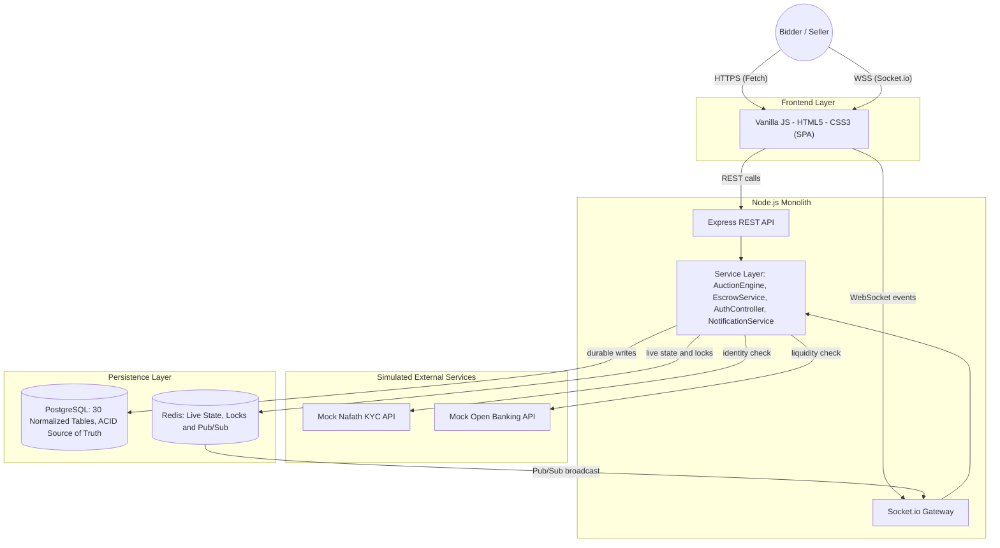

# Mezyad — Stage 3 Technical Documentation

**A High-Value Asset Auction Platform**
Graduation Capstone Project

---

## 1. Preface

Mezyad is built around one hard problem, and it's bigger than just handling concurrent bids correctly: how do you build genuine end-to-end trust for a high-value transaction between two strangers who've never met — verifying who someone actually is, confirming the money behind their bid is real, running an auction that's fair under defined auction rules and strict concurrency guarantees, and then actually getting the asset from seller to buyer without either side getting burned? Every architectural choice in this document, from identity verification through escrow through the live auction itself through physical handover, traces back to that one problem: safety, at every single step, for a transaction that's too valuable to get wrong.

We didn't reach for a fashionable stack to make this look impressive. We reached for the smallest set of tools that could solve it *correctly*: a single Node.js service to keep the system easy to reason about, PostgreSQL to be the authoritative source of durable financial truth, and Redis to provide fast coordination and real-time state. The interesting engineering in Mezyad isn't in the number of technologies we used — it's in how deliberately we drew the line between what PostgreSQL is responsible for and what Redis is responsible for, and in how strictly we enforced that line in code.

Where a real integration would normally sit — verifying a user's national identity, checking that a bidder's bank account actually has the funds — we built clean, interface-matched **mock services**. This wasn't a shortcut we're hiding; it's a deliberate architectural decision. The mock and a real integration expose the exact same contract, so the rest of the system — `AuthController`, `EscrowService`, every downstream consumer — has no idea, and needs no code change, whether it's talking to a simulation or the real thing. That separation of concerns is the actual point being demonstrated.

What follows is the complete technical blueprint: the user stories that shaped our priorities, the architecture that makes the system work, the class design that keeps our backend maintainable, the database design that keeps our data honest, the sequence diagrams that trace our critical flows end to end, our API surface, and how we kept quality under control as we built it.

---

## 2. User Stories & Mockups

### 2.1 Prioritized User Stories (MoSCoW)

| Priority | Role | User Story |
|---|---|---|
| **Must Have** | Bidder | As a bidder, I want to see the auction price update instantly through a WebSocket connection, without refreshing the page, so that I never lose a bid to network lag in the final seconds. |
| **Must Have** | Seller | As a seller, I want to list an item with supporting documents and photos, so that it can go through an appraisal step before it's allowed to go live. |
| **Must Have** | System | As the system, I want to lock a security deposit in the bidder's wallet before they're allowed to place a bid, so that no bid is ever placed without real financial backing behind it. |
| **Should Have** | Admin | As an admin, I want a moderation view of active auctions and open disputes, so that I can intervene quickly if something looks wrong. |
| **Should Have** | Winner | As a winning bidder, I want an invoice generated automatically the moment the auction closes, so that I have a clear, timestamped record of what I owe. |
| **Could Have** | Bidder | As a bidder, I want to set a maximum proxy bid, so that the system bids for me automatically up to my limit without me having to sit and watch the clock. |

Each priority level here maps directly onto risk: the "Must Have" rows are the three things that, if broken, make the entire platform untrustworthy — a stale price, an unverified item, or an unbacked bid. Everything below that is real value, but value that a working core doesn't strictly depend on.

### 2.2 UI Mockups & Design Approach

The interface is deliberately built to reduce cognitive load during the one moment that actually matters: the closing seconds of a bid. The live price, the countdown timer, and the bid input stay in constant view, on a dark, high-contrast layout, so a bidder never has to scroll or search for the number that's about to change under them.

Architecturally, this is a Single Page Application built in **pure Vanilla JavaScript, HTML5, and CSS3** — no framework in between us and the DOM. That was a deliberate, practical call for a two-month build: with four of us already splitting our time across a real-time backend and a dual-database layer, taking on a framework's tooling and learning curve on top of that wasn't where our limited time was best spent. Vanilla JS kept the frontend lightweight and predictable, and let us put our energy where the actual hard engineering problem lived — the backend. Communication is deliberately split by purpose rather than convenience:

* The **Fetch API** carries everything transactional — logging in, submitting a listing, viewing bid history. These are one-off requests where the normal overhead of an HTTP round trip is completely invisible to the user; nobody notices or cares if a login takes a beat longer.
* A **Socket.io client** carries everything time-sensitive — price ticks, countdown extensions, being outbid. These are events where any added delay matters, because a competing bidder's request could land in that exact gap — so this channel is built specifically to avoid overhead the REST channel can comfortably afford.

Keeping these two channels physically separate means a slow REST call — say, a seller uploading a large document — can never block a live price update from reaching a bidder in a different auction entirely.

---

## 3. System Architecture

Mezyad runs as a single Node.js monolith. That single-process design is what makes the rest of the architecture legible: every request, whether it arrives over HTTP or over a WebSocket, ultimately calls into the same shared service layer, which is the only layer allowed to touch the database or Redis. Express and Socket.io are two different *doors* into that layer — they are never two different sources of truth.

## Containerization & Environment Consistency (Docker)

To ensure that the entire platform (Frontend, Backend, PostgreSQL, and Redis) runs identically across every team member's machine without setup discrepancies, Mezyad is fully containerized using Docker and Docker Compose.

Instead of manual local installations, a single command spins up the isolated services:
- **Database & Cache:** PostgreSQL (30 normalized tables) and Redis (locks and live state) run in dedicated persistent containers.
- **Backend Service:** The Node.js monolith runs in its container with direct environment linkage.
- **Frontend SPA:** Vanilla JavaScript files are served efficiently via a lightweight Nginx container.

This guarantees a reproducible, production-like development environment from day one.

Walking through the diagram left to right: a user's browser talks to the SPA over two independent channels. Transactional actions flow through Express into the service layer. Time-critical actions — almost entirely bidding — flow through the Socket.io gateway into that same service layer. The service layer is the only code in the system that decides *what* gets written where: durable financial and audit-relevant records go to PostgreSQL; fast-changing, short-lived coordination state goes to Redis. Redis then feeds back into the WebSocket gateway through Pub/Sub, which is how a price change caused by one bidder's request reaches every other connected client without the gateway ever having to poll anything.

The mock services sit to the side of this flow for a specific reason: they are called *by* the service layer, but they don't own any state of their own — they simply return a response shaped to our internal integration contract, which `AuthController` and `EscrowService` consume exactly as they would consume a response from a real provider behind that same contract. Nothing about the request/response boundary changes based on whether the service behind it is real or simulated.

---

## 4. Backend Components & Class Design

We deliberately organized the backend around a small number of single-responsibility services rather than one large controller file. The reasoning is concurrency of a different kind — not database concurrency, but *team* concurrency: with four people working in the same codebase, a clear class boundary is what lets two of us work on escrow logic and bidding logic in the same week without stepping on each other's changes.

### 4.1 Core Classes

* **`AuthController`** — owns registration, login, and session issuance, and delegates identity verification to the mock KYC service. It knows nothing about auctions, bids, or money — that separation means a change to how we verify identity can never accidentally touch financial logic.
* **`AuctionEngine`** — owns the full lifecycle of an auction: opening it, accepting or rejecting incoming bids, closing it at `end_time`, and triggering anti-sniping extensions when a bid lands in the final seconds. This is the class we tested most aggressively, because it's the single point where a logic error would directly cost someone real money. The trickiest edge case is a bid arriving in the exact same instant `end_time` is reached — closing an auction and evaluating a bid are both gated by the same Redlock for that `auction_id`, so the two can never actually happen concurrently. Whichever operation acquires the lock first decides the outcome: if the closing job gets there first, the auction is already closed by the time the bid is evaluated, and it's rejected outright; if the bid gets there first, it's evaluated as valid and, because it landed inside the anti-sniping window, extends `end_time` rather than racing the clock. There's no ambiguous middle state where both could be considered to have won. Closing an auction is also what triggers generation of the signed, time-bound handover token that secures the physical exchange between winner and seller (see Section 5.1). The MVP is scoped entirely to the live ascending format described above — that's the one auction type this engine runs today; anything beyond it is out of scope for this release (see the Future Enhancements note at the end of this document).
* **`EscrowService`** — the only class in the entire codebase permitted to modify a wallet's `available_balance` or `escrow_frozen_balance`. Locking a deposit, releasing it after a successful handover, and refunding it after a resolved dispute all pass through here and only here. That single-writer discipline is what makes the ledger auditable — if a balance is ever wrong, there is exactly one place to look. The deposit amount itself isn't a flat number: it's set per auction, either as a fixed value or as a percentage of the starting price defined in `auction_rules`. Each lock is also recorded as its own `escrow_deposits` row rather than folded into a single running total, so a bidder active in three auctions at once has three separate, individually-tracked amounts moved out of `available_balance` and into `escrow_frozen_balance`. `EscrowService` always sums those individual rows rather than trusting one combined figure, which is exactly what stops one auction's deposit from ever being silently double-counted against, or confused with, another.
* **`WsHandler`** — the Socket.io gateway. It authenticates each socket connection, subscribes a client to the correct auction "room," and translates internal domain events (`bid.accepted`, `auction.extended`) into the outbound WebSocket messages the frontend listens for.
* **`BidValidator`** — a small, stateless helper that `AuctionEngine` calls before accepting any bid: it checks the minimum increment, confirms the auction is still within its active time window, and confirms the bidder actually has a locked escrow deposit. We split this out from `AuctionEngine` specifically so these rules could be unit-tested in isolation, without needing a running auction, a database, or Redis.
* **`NotificationService`** — renders every user-facing notification from the append-only `event_store`, pushing it live over WebSocket if the user is currently connected, or queuing it for delivery the next time they log in if they're not. Treating a notification as a rendered view over the audit trail — rather than maintaining a second, separately-written log — meant one less place for the two to drift out of sync.
* **`InvoiceService`** — the moment `AuctionEngine` closes an auction with a declared winner, this generates the PDF invoice and tax breakdown for that transaction.
* **`DisputeService`** — opens, tracks, and resolves disputes raised after a handover. It is the only other class besides `EscrowService` allowed to trigger a refund, and it can only do so after an admin decision has actually been recorded — never automatically.

### 4.2 Class Diagram

`AuctionEngine` sits at the center of this diagram by design — almost everything the platform does eventually routes through it, because almost everything the platform does is, in one way or another, a consequence of a bid being placed or an auction closing.

---

## 5. Database Design (Polyglot Persistence)

The single question this section has to answer convincingly is: **why two databases instead of one?** The answer is that PostgreSQL and Redis are each excellent at solving a problem the other one isn't built for, and forcing one database to do both jobs would have meant compromising on one of them.

### 5.1 PostgreSQL — ACID for Everything That Must Never Be Wrong

An escrow ledger cannot tolerate eventual consistency. The instant a deposit is locked, that lock has to be atomic and durable — there is no acceptable window where a wallet's displayed balance is stale or ambiguous. PostgreSQL gives us three things Redis fundamentally cannot:

* **Atomicity** — a wallet update, an `escrow_deposits` insert, and a `transactions` log entry either all succeed together or none of them do. There's no partial state where money appears to have moved but the audit trail doesn't reflect it.
* **Durability** — anything representing money, ownership, or an audit-relevant record (invoices, dispute resolutions, KYC status) survives a crash, a restart, or a bad deploy, because it was committed to disk, not held in memory.
* **Relational integrity, enforced by the database itself** — foreign keys guarantee that every reference actually points to something real: a bid's `auction_id` must correspond to an auction that genuinely exists, an item's `seller_id` must correspond to an actual user. What a foreign key can't tell you, and was never meant to, is whether that auction is still *open*. That's a business rule, not a structural one, so it lives where business rules belong — inside `AuctionEngine`'s transaction, which explicitly checks an auction's status and timing before it ever allows a bid to be written. The two mechanisms are deliberately complementary: foreign keys catch a reference that's broken, and application logic catches a reference that's valid but no longer meaningful.

The schema spans **30 normalized tables**, organized into six logical modules. This is down from an earlier draft that carried 36 tables — the Senior Architecture Review pushed us to prune anything that wasn't earning its place in the MVP, and we agreed with every cut. `sealed_bids`, `user_reviews`, and any residual notion of VIP private-room invites, an AI concierge, or AI-driven price prediction never made it into this release's schema; where a table's job could honestly be absorbed by an existing one instead of standing alone, we merged it rather than keep two structures doing one job:

**IAM & Security (6 tables)**
`users`, `roles`, `permissions`, `role_permissions`, `kyc_verifications`, `user_sessions`
— Authentication, role-based access control, and the record of every user's mock identity verification.

**Ledger & Escrow (6 tables)**
`wallets`, `bank_accounts`, `escrow_deposits`, `transactions`, `withdrawal_requests`, `invoices`
— Every movement of money on the platform. Platform fee data now lives directly on `invoices` as a computed breakdown rather than in its own standalone table — one less join for a number that's always read alongside the invoice it belongs to.

**Catalog & Items (6 tables)**
`categories`, `items`, `item_media`, `item_documents`, `appraisal_workflows`, `authenticator_reviews`
— Item listings and the human appraisal step that gates them before they're allowed to go live. `items` carries no smart-contract or digital-twin fields in this release; blockchain-backed ownership is future scope, not something half-wired into the current schema.

**Auction Engine (6 tables)**
`auctions`, `bids`, `proxy_bids`, `auction_extensions`, `auction_watchers`, `auction_rules`
— The bidding lifecycle itself, including the full history of anti-sniping extensions and every proxy bid limit ever set. There's no `sealed_bids` table in this schema — the live ascending format is the only auction type Mezyad runs, and we'd rather ship one auction type that works completely than two where one is half-built.

**Handover & Disputes (5 tables)**
`auction_results`, `secure_handovers`, `inspection_appointments`, `disputes`, `dispute_messages`
— What happens after the hammer falls: physical handover verification, and the full lifecycle of a raised dispute. `secure_handovers` stores more than a raw QR value — the code itself is a signed, time-bound token generated specifically for one `auction_id` and its winning bidder, so it can't be reused for a different auction, presented by anyone else, or honored after its window expires. The moment `is_scanned_and_released` flips to true, that row is effectively closed: a second scan of the same code is checked against that flag and rejected outright, rather than ever triggering a second release of funds. Evidence attached to a dispute lives directly on `dispute_messages` rather than in a separate table, since in practice every piece of evidence arrives attached to a message in the dispute thread.

**Audit (1 table)**
`event_store`
— A single, append-only audit trail of every critical action taken on the platform. `NotificationService` renders both live and historical notifications directly from `event_store` rather than maintaining a second, separately-written log, and a user's notification preferences live as a column on their `users` row rather than in a dedicated table. Post-auction reviews were cut from this release entirely rather than folded elsewhere — that feature just isn't part of the current scope.

*(The full Mermaid ER diagram covering all 30 tables and their relationships is provided separately.)*

### 5.1.1 Database Tables

The full list, for quick reference — grouped in the same order as the modules above:

| # | Table | Purpose |
|---|---|---|
| 1 | `users` | User accounts |
| 2 | `roles` | Role definitions for access control |
| 3 | `permissions` | Individual permission definitions |
| 4 | `role_permissions` | Maps roles to permissions |
| 5 | `kyc_verifications` | Mock identity-verification records |
| 6 | `user_sessions` | Active login sessions |
| 7 | `wallets` | Available and escrow-frozen balances |
| 8 | `bank_accounts` | Linked bank accounts for withdrawals and liquidity checks |
| 9 | `escrow_deposits` | Individually-tracked locked deposit amounts |
| 10 | `transactions` | Ledger of every financial movement |
| 11 | `withdrawal_requests` | Seller payout requests and their approval status |
| 12 | `invoices` | Generated invoices, including fee breakdown |
| 13 | `categories` | Asset categories |
| 14 | `items` | Listed assets |
| 15 | `item_media` | Photos and media attached to a listing |
| 16 | `item_documents` | Supporting documents attached to a listing |
| 17 | `appraisal_workflows` | Human appraisal/approval steps for a listing |
| 18 | `authenticator_reviews` | Individual authenticator sign-offs within an appraisal |
| 19 | `auctions` | Auction records |
| 20 | `bids` | Individual bids placed |
| 21 | `proxy_bids` | Stored maximum proxy-bid limits |
| 22 | `auction_extensions` | Log of anti-sniping time extensions |
| 23 | `auction_watchers` | Users currently watching an auction |
| 24 | `auction_rules` | Per-auction configuration (increments, deposit rules, timing) |
| 25 | `auction_results` | Final outcome of a closed auction |
| 26 | `secure_handovers` | Signed, time-bound handover QR tokens |
| 27 | `inspection_appointments` | Scheduled in-person handover/inspection meetings |
| 28 | `disputes` | Raised disputes |
| 29 | `dispute_messages` | Dispute thread messages, including attached evidence |
| 30 | `event_store` | Append-only audit trail of all critical actions |

### 5.2 Redis — Speed and Coordination for the Real-Time Layer

PostgreSQL remains the authoritative source of truth for Mezyad at every moment — every committed bid, every locked deposit, every auction result lives there, permanently, and nowhere else. What PostgreSQL isn't built to do is act as the sole gatekeeper for every incoming bid during a genuine bidding war, where a burst of concurrent requests can target the exact same auction within the exact same second — each of those requests would otherwise have to queue behind the same relational locks and transaction overhead, which exists precisely to guarantee durability, not to arbitrate a race. That's not a shortcoming of the database — it's simply outside the problem it was designed to solve. Redis exists specifically to close that gap: it acts as the fast coordination layer that serializes concurrent bidding operations — through Redlock — before the authoritative transaction is committed to PostgreSQL, so that by the time a write actually reaches PostgreSQL, it's already been serialized and properly ordered. Redis coordinates and caches; it never decides. PostgreSQL's transaction is what actually determines whether a bid is accepted.

Two Redis capabilities carry almost the entire real-time layer:

**Redlock (distributed locking).** Before `AuctionEngine` accepts any bid, it must first acquire a short-lived lock scoped to that specific `auction_id`. This is the exact mechanism that prevents the classic race condition of live bidding: two bids arriving within milliseconds of each other, both being evaluated against the same stale price, and both being told they're now the highest bidder. The lock doesn't impose any ordering across the platform as a whole — its scope is deliberately narrow: it guarantees that, for one specific auction, only one bid is ever inside the critical section (read current price, validate, commit) at a time. That narrow scope is exactly where the race condition lives, so that's exactly where the lock needs to apply.

**Pub/Sub (broadcast).** Once a bid has cleared the Redlock, passed validation, and been committed to PostgreSQL as the new authoritative state, its price is published to a channel dedicated to that auction. Every server-side socket subscribed to that channel — and therefore every browser currently watching — receives the update in the same tick, because the WebSocket connection stays open for the life of the auction: there's no repeated HTTP handshake or header overhead standing between the write being confirmed and the client seeing it. No client ever polls for a price; it's pushed the moment the write that actually matters has been confirmed.

Put together, every incoming bid follows the same fixed order, and no step is ever skipped or reordered:

1. Bid arrives (manual or proxy-generated)
2. Acquire the per-auction Redlock
3. Fast preliminary Redis price check (optimization only — not a decision)
4. Authoritative validation via `BidValidator`
5. PostgreSQL transaction (the actual decision)
6. Commit
7. Update the Redis cache
8. Publish the event
9. WebSocket broadcast
10. Release the lock

Redis appears twice in this list — once as a cheap early filter, once as a cache write after the fact — and neither appearance is where the bid is actually decided. That happens once, in step 5.

**Redis key schema:**

| Key Pattern | Type | Purpose |
|---|---|---|
| `auction:{id}:price` | String | The current highest accepted bid — a fast-path cached value read on every incoming bid as a preliminary optimization, to short-circuit obviously-too-low offers before they spend time on the authoritative path. It is never the final word: because this value can go stale between writes, the bid still has to clear `BidValidator` and the PostgreSQL transaction before it's actually accepted, and on any desync the key is simply overwritten from PostgreSQL rather than trusted as-is. |
| `auction:{id}:lock` | String (TTL) | The Redlock mutex itself; a bid can only enter its critical section while this key can be successfully acquired. |
| `auction:{id}:watchers` | Set | The set of user IDs currently subscribed to that auction's live channel. |
| `auction:{id}:end_time` | String | A cached copy of the auction's end time, checked on every bid and updated in place whenever anti-sniping extends it — avoiding a database round-trip on the single hottest path in the system. |
| `bid:{auctionId}:events` | Pub/Sub channel | The broadcast channel `WsHandler` subscribes to for pushing price and extension updates out to connected clients. |

If a PostgreSQL write ever fails partway through — a constraint violation, a dropped connection, anything — the entire transaction rolls back, the bid is treated as rejected, and nothing is ever published to Redis or broadcast to a client. Redis only ever announces a price that PostgreSQL has already agreed actually happened. That ordering is the whole point: Redis is what makes the platform feel responsive, but PostgreSQL's transaction is what actually decides whether the bid happened at all.

The reverse failure — the PostgreSQL commit succeeds, but the Redis update or the broadcast that follows it doesn't — is the one edge case we designed for explicitly, because it's the one place the two stores could actually end up disagreeing. We treat that as a cache desync, not a data problem: PostgreSQL already holds the correct price, so recovery just means re-deriving Redis's cached state from it, never trusting whatever partial write Redis was left with. Before evaluating the next bid on that auction, `AuctionEngine` re-reads the current price straight from PostgreSQL and overwrites the Redis key with it, so a stale or half-written cache entry can never be evaluated against as if it were correct. PostgreSQL serves as the absolute recovery base in this scenario — Redis is rebuilt from it, never the other way around. The same logic covers `auction:{id}:end_time` — it's a cache of a PostgreSQL column, never treated as a value in its own right, so it can always be safely re-synced from the row that actually owns it.

---

## 6. Sequence Diagrams

We condensed what used to be eleven separate flows into **8 core flows** — several of the original eleven were really the same underlying mechanism described from different angles, and packing them together made the actual architecture easier to follow, not harder. Each flow below has a one-sentence description of the logic it enforces; the full Mermaid sequence diagram source for each is provided separately.

### Flow 1: User Onboarding & Identity Verification (Nafath/KYC)
A new user registers, the mock identity service returns a simulated verification result, and only on a successful result is the account fully activated for bidding.

### Flow 2: Item Listing & Appraisal Workflow
A seller submits an item along with supporting documents, and — while an AI-assisted scoring pass is on our roadmap and not part of this release — the listing stays in a pending state until a human evaluator formally approves it as authentic.

### Flow 3: Open Banking & Escrow Funding Check
Before a bidder can enter an auction, the mock banking service simulates a liquidity check against the bidder's account, and only on success does `EscrowService` lock the required deposit.

### Flow 4: Live Bidding Engine ⭐
This is the flow that does the most work in the system, because manual bidding, proxy bidding, and anti-sniping all funnel through the exact same critical path rather than three separate code paths — there is exactly one bidding pipeline, not three. A bid, whether typed by a bidder or generated automatically by their stored proxy limit, arrives over WebSocket carrying a client-generated `requestId`; `AuctionEngine` first checks that ID against recently processed requests for that bidder (this is the entire idempotency mechanism — bid amount is never used to detect a duplicate), then acquires the Redlock for that specific `auction_id`, runs a fast preliminary Redis price check purely as an early filter, and only then performs the authoritative validation through `BidValidator` and commits the bid to PostgreSQL as the new authoritative state. Only once that write succeeds does it update the cached price in Redis, publish the event, and broadcast it over Pub/Sub to every watcher. If a bid lands inside the anti-sniping window, the same PostgreSQL transaction extends `end_time` before anything is released to Redis, and the extension is synced to Redis and broadcast alongside the price update. If the PostgreSQL write fails for any reason, the bid is rolled back, the lock is released, and nothing is ever broadcast.

### Flow 5: Auction Conclusion & Financial Settlement
A scheduled job closes the auction the instant `end_time` is reached, acquiring the same per-auction Redlock a bid would need — the exact same concurrency protection described in Section 4.1's close-vs-bid race — so a closing job and a last-second bid can never both be evaluated as if the auction were still open. Once closure wins the lock, the auction result is recorded, the winner is determined, `InvoiceService` produces the invoice, and the signed, time-bound handover token is generated — all without any manual step, and with no blockchain or external settlement layer involved.

### Flow 6: Secure Handover via Cryptographic Dynamic QR
The buyer and seller meet in person, and a signed, time-bound QR code generated specifically for that auction and its winning bidder is scanned; the scan is checked against that binding and against whether the code has already been used, and only a fresh, valid, first-time scan releases the escrowed funds to the seller.

### Flow 7: Dispute Resolution & Escrow Handling
A buyer opens a dispute with supporting evidence, the relevant escrow is frozen for the duration of the review, and only a recorded admin decision can trigger either a release to the seller or a refund to the buyer.

### Flow 8: Seller Withdrawal Request & Admin Approval
A seller requests a payout of their available balance; the system first confirms that balance is actually withdrawable — not locked in an open escrow or frozen by an active dispute — before a `withdrawal_request` is created with status `PENDING`. An admin reviews the request: on approval, the payout is executed and the wallet and `transactions` row are updated together inside one PostgreSQL transaction; on rejection, the request moves to `REJECTED` with the reason recorded. Either outcome is logged to `event_store` for audit. No blockchain or external payment rail is involved — the transfer itself is simulated, consistent with the rest of the mock-service boundary.

---

## 7. API Specifications

### 7.1 REST vs. WebSocket: A Deliberate Split

Mezyad's API surface follows one consistent rule: **anything transactional is REST, anything time-sensitive is a WebSocket event.** Placing a bid, specifically, is *never* a REST endpoint in this system — it is exclusively a WebSocket event, because the WebSocket connection stays open for the life of the auction, so a bid travels over an already-established channel instead of paying for a fresh HTTP handshake and headers on every single request. That overhead is completely fine for a one-off action like logging in; it's not something worth paying repeatedly on the one path where a competing bidder's request could land in the gap it creates. Reserving REST for actions where that overhead is invisible to the user is what keeps the real-time channel free of unnecessary load.

| Endpoint | Method | Body | Description |
|---|---|---|---|
| `/api/v1/auth/register` | POST | `{ name, email, password }` | Creates a new user and triggers the mock KYC verification flow. |
| `/api/v1/auth/login` | POST | `{ email, password }` | Authenticates a user and issues a session token. |
| `/api/v1/items` | POST | `{ title, description, categoryId, documents[] }` | Submits a new item listing for appraisal. |
| `/api/v1/escrow/deposit` | POST | `{ auctionId, amount }` | Runs the mock liquidity check and, on success, locks the required escrow deposit. |
| `/api/v1/auctions/{id}` | GET | — | Retrieves full auction and item details for the auction page. |
| `/api/v1/handovers/verify-qr` | POST | `{ qrHash, auctionId }` | Verifies the handover QR code and releases the escrowed funds to the seller. |
| `/api/v1/withdrawals` | POST | `{ amount, bankAccountId }` | Creates a pending withdrawal request for admin review. |

**WebSocket events** (deliberately kept off the REST surface): `bid:place`, `bid:accepted`, `bid:rejected`, `auction:extended`, `auction:closed`.

**Handling retries and duplicate submissions.** A flaky connection is exactly the kind of thing that makes a bidder tap "bid" twice, or makes their client silently retry after a dropped WebSocket frame — and on this path, a duplicate isn't a cosmetic annoyance, it's a second bid and a second escrow check. Every `bid:place` event carries a client-generated `requestId` alongside the auction ID, bidder ID, and amount, and this `requestId` is the sole, authoritative mechanism we use to detect a retry — `AuctionEngine` checks it against a short-lived record of recently processed request IDs for that bidder before doing anything else, and if it's seen that exact `requestId` before, it just returns the original result instead of processing the bid again. We deliberately do **not** fall back to matching on bid amount as a secondary signal: a bidder can legitimately place two genuinely separate bids of the same amount (for example, after being outbid and then outbid again back to the same number), so amount-based matching would risk silently dropping a valid bid rather than catching a duplicate. `requestId` is unambiguous where amount is not, which is exactly why it's the only mechanism this system trusts for idempotency.

### 7.2 Mock External Services

| Service | Simulates | Behavior |
|---|---|---|
| **Mock Nafath API** | National identity verification | Returns a success or failure response after a short, deliberately realistic delay, matching the response structure defined by our internal integration contract for identity verification. |
| **Mock Open Banking API** | Proof-of-funds / liquidity check | Returns a simulated available balance for a given IBAN, used purely to gate whether an escrow deposit can be locked. |

Both mocks were built to the same interface contract a live integration would expose. The engineering value here is entirely in that contract — in the fact that `AuthController` and `EscrowService` are written against an interface, not against a specific implementation, so either mock could be replaced by a real service without touching a single line of business logic downstream.

---

## 8. SCM and QA Plans

### 8.1 Implementation Tiers & Scope Reality

Not everything in this document carries the same level of confidence, and we'd rather say that plainly than let the schema imply more than the code delivers. We split what we actually built into two honest tiers:

* **Tier A — Core MVP (must work, fully wired end to end):** WebSocket bidding, PostgreSQL, Redis, Redlock, escrow locking and release, the full auction lifecycle, anti-sniping extensions, mock KYC verification, the appraisal workflow, and secure QR handover. If any of these were broken, the platform wouldn't be trustworthy — this is the set we tested hardest and are most confident defending line by line.
* **Tier B — Differentiation (implemented, adds real value on top of the core):** proxy bidding, dispute resolution, withdrawal requests, notification delivery and reconnection handling, admin moderation views, `requestId`-based idempotency, and Redis-to-PostgreSQL reconciliation after a desync.

Anything beyond these two tiers wasn't built for this release, full stop — see the Future Enhancements note at the end of this document for what that includes and why it's out of scope on purpose.

### 8.2 Source Control Management

* **Tool:** GitHub.
* **Branching strategy:**
  * `main` — always deployable, protected from direct pushes.
  * `development` — the active integration branch for ongoing work.
  * `feature/*` — one branch per unit of work (for example, `feature/redis-locking`, `feature/proxy-bids`), kept short-lived and merged as soon as the feature is stable.
* **Review policy:** every merge into `development` requires review and approval from at least one other team member, which is what consistently catches the logic errors a single author reading their own code tends to miss.

### 8.3 Quality Assurance

* **Unit testing (Jest):** concentrated most heavily on `BidValidator` and `AuctionEngine`, with tests specifically designed to fire concurrent bid submissions at the same auction and verify that the Redlock genuinely prevents more than one bid from ever being accepted as the current highest. This layer also covers the close-vs-bid race directly (closing job vs. last-second bid competing for the same lock), `requestId` idempotency (a repeated request ID returns the original result rather than double-processing), and the PostgreSQL rollback path (a failed write is confirmed to leave no Redis publication and no broadcast behind it).
* **Manual integration testing:** each of the 8 core flows above is walked through end to end as part of our validation process — registration through mock KYC, escrow locking through the mock liquidity check, live bidding under simulated concurrent load, handover confirmation via QR scan, and the withdrawal request/admin approval path. This layer also includes a deliberate Redis desync test: the Redis cache is corrupted or cleared mid-auction, and we confirm `AuctionEngine` re-syncs it from PostgreSQL before trusting the next bid.
* **Focus of testing effort:** the overwhelming majority of our testing attention is directed at the live bidding path specifically, because it's the one part of the system where a race condition wouldn't just be a bug — it would be two people believing they'd won the same auction.

---

## Future Enhancements

Future versions may explore sealed-bid auctions, AI-assisted price estimation, AI concierge capabilities, and blockchain-backed digital ownership. These are intentionally outside the current release scope.
