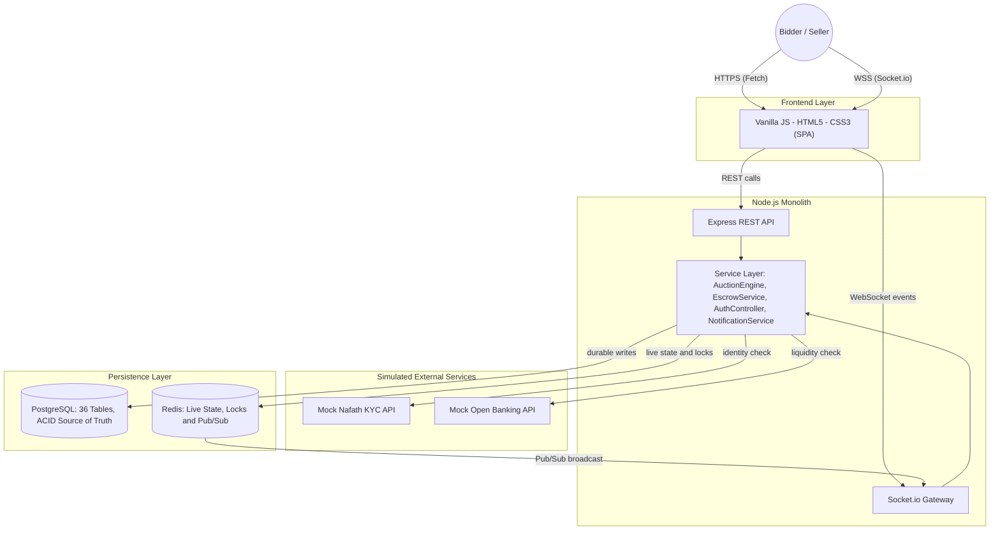
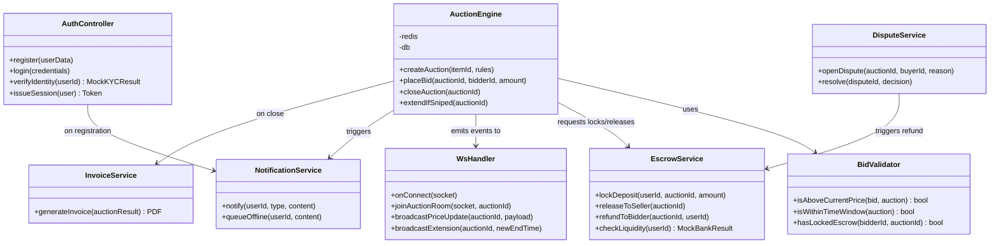

# Mezyad — Stage 3 Technical Documentation

**A High-Value Asset Auction Platform**
Graduation Capstone Project

---

## 1. Preface

Mezyad is built around one hard problem: how do you let dozens of people fight over the same rising price, in real time, without ever letting two of them win the same bid at once, and without ever letting money move that isn't actually backed by a locked deposit? Every architectural choice in this document traces back to that one problem.

We didn't reach for a fashionable stack to make this look impressive. We reached for the smallest set of tools that could solve it *correctly*: a single Node.js service to keep the system easy to reason about, PostgreSQL to be the one place where financial truth lives, and Redis to be the one place where speed lives. The interesting engineering in Mezyad isn't in the number of technologies we used — it's in how deliberately we drew the line between what PostgreSQL is responsible for and what Redis is responsible for, and in how strictly we enforced that line in code.

Where a real integration would normally sit — verifying a user's national identity, checking that a bidder's bank account actually has the funds — we built clean, interface-matched **mock services**. This wasn't a shortcut we're hiding; it's a deliberate architectural decision. The mock and a real integration expose the exact same contract, so the rest of the system — `AuthController`, `EscrowService`, every downstream consumer — has no idea, and needs no code change, whether it's talking to a simulation or the real thing. That separation of concerns is the actual point being demonstrated.

What follows is the complete technical blueprint: the user stories that shaped our priorities, the architecture that makes the system work, the class design that keeps our backend maintainable, the database design that keeps our data honest, the sequence diagrams that trace our critical flows end to end, our API surface, and how we kept quality under control as we built it.

---

## 2. User Stories & Mockups

### 2.1 Prioritized User Stories (MoSCoW)

| Priority | Role | User Story |
|---|---|---|
| **Must Have** | Bidder | As a bidder, I want to see the auction price update instantly through a WebSocket connection, without refreshing the page, so that I never lose a bid to network lag in the final seconds. |
| **Must Have** | Seller | As a seller, I want to list an item with supporting documents and photos, so that it can go through an appraisal step before it's allowed to go live. |
| **Must Have** | System | As the system, I want to lock a security deposit in the bidder's wallet before they're allowed to place a bid, so that no bid is ever placed without real financial backing behind it. |
| **Should Have** | Admin | As an admin, I want a moderation view of active auctions and open disputes, so that I can intervene quickly if something looks wrong. |
| **Should Have** | Winner | As a winning bidder, I want an invoice generated automatically the moment the auction closes, so that I have a clear, timestamped record of what I owe. |
| **Could Have** | Bidder | As a bidder, I want to set a maximum proxy bid, so that the system bids for me automatically up to my limit without me having to sit and watch the clock. |

Each priority level here maps directly onto risk: the "Must Have" rows are the three things that, if broken, make the entire platform untrustworthy — a stale price, an unverified item, or an unbacked bid. Everything below that is real value, but value that a working core doesn't strictly depend on.

### 2.2 UI Mockups & Design Approach

The interface is deliberately built to reduce cognitive load during the one moment that actually matters: the closing seconds of a bid. The live price, the countdown timer, and the bid input stay in constant view, on a dark, high-contrast layout, so a bidder never has to scroll or search for the number that's about to change under them.

Architecturally, this is a Single Page Application built in **pure Vanilla JavaScript, HTML5, and CSS3** — no framework in between us and the DOM. That's not a limitation we accepted; it's a decision that pushed us to genuinely understand how the browser renders state, rather than delegating that understanding to a library. Communication is deliberately split by purpose rather than convenience:

* The **Fetch API** carries everything transactional — logging in, submitting a listing, viewing bid history. These are requests where a few hundred milliseconds of latency is completely invisible to the user.
* A **Socket.io client** carries everything time-sensitive — price ticks, countdown extensions, being outbid. These are events where a few hundred milliseconds is the entire difference between winning and losing.

Keeping these two channels physically separate means a slow REST call — say, a seller uploading a large document — can never block a live price update from reaching a bidder in a different auction entirely.

---

## 3. System Architecture

Mezyad runs as a single Node.js monolith. That single-process design is what makes the rest of the architecture legible: every request, whether it arrives over HTTP or over a WebSocket, ultimately calls into the same shared service layer, which is the only layer allowed to touch the database or Redis. Express and Socket.io are two different *doors* into that layer — they are never two different sources of truth.

## Containerization & Environment Consistency (Docker)

To ensure that the entire platform (Frontend, Backend, PostgreSQL, and Redis) runs identically across every team member's machine without setup discrepancies, Mezyad is fully containerized using Docker and Docker Compose. 

Instead of manual local installations, a single command spins up the isolated services:
- **Database & Cache:** PostgreSQL (36 tables) and Redis (locks and live state) run in dedicated persistent containers.
- **Backend Service:** The Node.js monolith runs in its container with direct environment linkage.
- **Frontend SPA:** Vanilla JavaScript files are served efficiently via a lightweight Nginx container.

This guarantees a reproducible, production-like development environment from day one.

Walking through the diagram left to right: a user's browser talks to the SPA over two independent channels. Transactional actions flow through Express into the service layer. Time-critical actions — almost entirely bidding — flow through the Socket.io gateway into that same service layer. The service layer is the only code in the system that decides *what* gets written where: durable, legally meaningful state goes to PostgreSQL; fast-changing, short-lived coordination state goes to Redis. Redis then feeds back into the WebSocket gateway through Pub/Sub, which is how a price change caused by one bidder's request reaches every other connected client without the gateway ever having to poll anything.

The mock services sit to the side of this flow for a specific reason: they are called *by* the service layer, but they don't own any state of their own — they simply return a realistic, correctly-shaped response that `AuthController` and `EscrowService` consume exactly as they would consume a real Nafath or Open Banking response. Nothing about the request/response contract changes based on whether the service behind it is real or simulated.

---

## 4. Backend Components & Class Design

We deliberately organized the backend around a small number of single-responsibility services rather than one large controller file. The reasoning is concurrency of a different kind — not database concurrency, but *team* concurrency: with four people working in the same codebase, a clear class boundary is what lets two of us work on escrow logic and bidding logic in the same week without stepping on each other's changes.

### 4.1 Core Classes

* **`AuthController`** — owns registration, login, and session issuance, and delegates identity verification to the mock KYC service. It knows nothing about auctions, bids, or money — that separation means a change to how we verify identity can never accidentally touch financial logic.
* **`AuctionEngine`** — owns the full lifecycle of an auction: opening it, accepting or rejecting incoming bids, closing it at `end_time`, and triggering anti-sniping extensions when a bid lands in the final seconds. This is the class we tested most aggressively, because it's the single point where a logic error would directly cost someone real money.
* **`EscrowService`** — the only class in the entire codebase permitted to modify a wallet's `available_balance` or `escrow_frozen_balance`. Locking a deposit, releasing it after a successful handover, and refunding it after a resolved dispute all pass through here and only here. That single-writer discipline is what makes the ledger auditable — if a balance is ever wrong, there is exactly one place to look.
* **`WsHandler`** — the Socket.io gateway. It authenticates each socket connection, subscribes a client to the correct auction "room," and translates internal domain events (`bid.accepted`, `auction.extended`) into the outbound WebSocket messages the frontend listens for.
* **`BidValidator`** — a small, stateless helper that `AuctionEngine` calls before accepting any bid: it checks the minimum increment, confirms the auction is still within its active time window, and confirms the bidder actually has a locked escrow deposit. We split this out from `AuctionEngine` specifically so these rules could be unit-tested in isolation, without needing a running auction, a database, or Redis.
* **`NotificationService`** — writes every user-facing event to `notifications_log`, and pushes it live over WebSocket if the user is currently connected, or queues it for delivery the next time they log in if they're not.
* **`InvoiceService`** — the moment `AuctionEngine` closes an auction with a declared winner, this generates the PDF invoice and tax breakdown for that transaction.
* **`DisputeService`** — opens, tracks, and resolves disputes raised after a handover. It is the only other class besides `EscrowService` allowed to trigger a refund, and it can only do so after an admin decision has actually been recorded — never automatically.

### 4.2 Class Diagram

`AuctionEngine` sits at the center of this diagram by design — almost everything the platform does eventually routes through it, because almost everything the platform does is, in one way or another, a consequence of a bid being placed or an auction closing.

---

## 5. Database Design (Polyglot Persistence)

The single question this section has to answer convincingly is: **why two databases instead of one?** The answer is that PostgreSQL and Redis are each excellent at solving a problem the other one isn't built for, and forcing one database to do both jobs would have meant compromising on one of them.

### 5.1 PostgreSQL — ACID for Everything That Must Never Be Wrong

An escrow ledger cannot tolerate eventual consistency. The instant a deposit is locked, that lock has to be atomic and durable — there is no acceptable window where a wallet's displayed balance is stale or ambiguous. PostgreSQL gives us three things Redis fundamentally cannot:

* **Atomicity** — a wallet update, an `escrow_deposits` insert, and a `transactions` log entry either all succeed together or none of them do. There's no partial state where money appears to have moved but the audit trail doesn't reflect it.
* **Durability** — anything representing money, ownership, or a legal record (invoices, dispute resolutions, KYC status) survives a crash, a restart, or a bad deploy, because it was committed to disk, not held in memory.
* **Relational integrity enforced by the database itself** — foreign keys mean an auction literally cannot reference a seller who doesn't exist, and a bid cannot reference an auction that's already closed. These rules aren't just checked in application code that could have a bug; they're structurally impossible to violate.

The schema spans **36 tables**, organized into six logical modules:

**IAM & Security (6 tables)**
`users`, `roles`, `permissions`, `role_permissions`, `kyc_verifications`, `user_sessions`
— Authentication, role-based access control, and the record of every user's mock identity verification.

**Ledger & Escrow (6 tables)**
`wallets`, `bank_accounts`, `escrow_deposits`, `transactions`, `platform_fees`, `invoices`
— Every movement of money on the platform, and the fee structure that funds it.

**Catalog & Items (6 tables)**
`categories`, `items`, `item_media`, `item_documents`, `appraisal_workflows`, `authenticator_reviews`
— Item listings and the human appraisal step that gates them before they're allowed to go live.

**Auction Engine (7 tables)**
`auctions`, `bids`, `proxy_bids`, `auction_extensions`, `auction_watchers`, `sealed_bids`, `auction_rules`
— The bidding lifecycle itself, including the full history of anti-sniping extensions and every proxy bid limit ever set.

**Handover & Disputes (6 tables)**
`auction_results`, `secure_handovers`, `inspection_appointments`, `disputes`, `dispute_messages`, `dispute_evidence`
— What happens after the hammer falls: physical handover verification, and the full lifecycle of a raised dispute.

**Notifications, Reviews & Audit (5 tables)**
`notifications_log`, `notification_preferences`, `user_reviews`, `withdrawal_requests`, `event_store`
— User-facing communication, post-auction trust signals between buyers and sellers, cash-out requests, and an append-only audit trail of every critical action taken on the platform.

*(The full Mermaid ER diagram covering all 36 tables and their relationships is provided separately.)*

### 5.2 Redis — Speed and Coordination for the Real-Time Layer

PostgreSQL, per individual query, is not fast enough to be the single source of truth during a genuine bidding war, where dozens of concurrent requests can target the same auction within the same second. That isn't a flaw in PostgreSQL — it's simply not the problem it was designed to solve. Redis exists specifically to handle what PostgreSQL wasn't built for: **in-memory speed, and safe coordination between many simultaneous writers.**

Two Redis capabilities carry almost the entire real-time layer:

**Redlock (distributed locking).** Before `AuctionEngine` accepts any bid, it must first acquire a short-lived lock scoped to that specific `auction_id`. This is the exact mechanism that prevents the classic race condition of live bidding: two bids arriving within milliseconds of each other, both being evaluated against the same stale price, and both being told they're now the highest bidder. The lock guarantees that bids on the same auction are always evaluated one at a time, in strict order, no matter how many arrive simultaneously.

**Pub/Sub (broadcast).** The moment a bid is accepted and its lock released, the new price is published to a channel dedicated to that auction. Every server-side socket subscribed to that channel — and therefore every browser currently watching that auction — receives the update in the same tick. No client ever polls for a price; the price is pushed the instant it changes.

**Redis key schema:**

| Key Pattern | Type | Purpose |
|---|---|---|
| `auction:{id}:price` | String | The current highest accepted bid — the hot-path value read and written on every incoming bid. |
| `auction:{id}:lock` | String (TTL) | The Redlock mutex itself; a bid can only be processed while this key can be successfully acquired. |
| `auction:{id}:watchers` | Set | The set of user IDs currently subscribed to that auction's live channel. |
| `auction:{id}:end_time` | String | A cached copy of the auction's end time, checked on every bid and updated in place whenever anti-sniping extends it — avoiding a database round-trip on the single hottest path in the system. |
| `bid:{auctionId}:events` | Pub/Sub channel | The broadcast channel `WsHandler` subscribes to for pushing price and extension updates out to connected clients. |

It's worth being precise about the relationship between the two stores: every value Redis holds is either a **cache of**, or a **coordination primitive over**, data that PostgreSQL still owns as the ultimate record. A bid is only ever considered final once it has also been durably written to `bids` and `event_store` in PostgreSQL. Redis is what makes the platform feel instantaneous to a user; PostgreSQL is what guarantees that nothing that instant feeling produced is ever actually lost.

---

## 6. Sequence Diagrams

Eleven sequence diagrams trace the platform's critical flows end to end, from the first moment a user registers to the resolution of a dispute after a handover. Each is described here by the specific logic it enforces.

1. **User Onboarding & Mock KYC Verification** — a new user registers, the mock identity service returns a simulated verification result, and only on a successful result is the account fully activated for bidding.
2. **Item Listing & Appraisal Workflow** — a seller submits an item along with supporting documents, and the listing remains in a pending state until a human evaluator formally approves it as authentic.
3. **Escrow Deposit via Mock Open Banking Check** — before a bidder can enter an auction, the mock banking service simulates a liquidity check against the bidder's account, and only on success does `EscrowService` lock the required deposit.
4. **Live Bidding Engine** — a bid arrives over WebSocket, `AuctionEngine` acquires the Redlock for that auction, validates the bid through `BidValidator`, updates the price in Redis, and broadcasts the new price to every watcher — with the durable database write happening immediately after.
5. **Auction Conclusion & Invoice Generation** — a scheduled job closes the auction the instant `end_time` is reached, records the final result, and `InvoiceService` generates the winning bidder's invoice without any manual step.
6. **Secure Handover Confirmation** — the buyer and seller meet in person, a QR code uniquely tied to that auction is scanned, and that scan — and only that scan — is what releases the escrowed funds to the seller.
7. **Automated Proxy Bidding** — whenever a bidder is outbid, the system checks whether they have a stored maximum proxy limit, and if so, automatically places a new bid on their behalf up to that ceiling, with no manual action required.
8. **Anti-Sniping Auction Extension** — a bid placed within the final seconds of an auction automatically extends its end time, with the extension logged for full transparency, so no bidder can win purely by exploiting timing.
9. **Dispute Resolution** — a buyer opens a dispute with supporting evidence, the relevant escrow is frozen for the duration of the review, and only a recorded admin decision can trigger either a release to the seller or a refund to the buyer.
10. **Withdrawal Request & Admin Approval** — a seller requests a payout from their wallet, and the request sits in a reviewable pending state until an admin approves it, before any transfer is simulated.
11. **Real-Time Notification Delivery & Reconnection Handling** — when a user's WebSocket connection drops mid-auction and later reconnects, `WsHandler` re-subscribes them to the correct auction room, and `NotificationService` delivers anything they missed while they were offline.

*(The full Mermaid sequence diagram source for each of these eleven flows is provided separately.)*

---

## 7. API Specifications

### 7.1 REST vs. WebSocket: A Deliberate Split

Mezyad's API surface follows one consistent rule: **anything transactional is REST, anything time-sensitive is a WebSocket event.** Placing a bid, specifically, is *never* a REST endpoint in this system — it is exclusively a WebSocket event, because a bid delayed even a few hundred milliseconds by ordinary HTTP overhead could genuinely be the difference between winning and losing an auction. Reserving REST for actions where that latency is invisible to the user is what keeps the real-time channel free of unnecessary load.

| Endpoint | Method | Body | Description |
|---|---|---|---|
| `/api/v1/auth/register` | POST | `{ name, email, password }` | Creates a new user and triggers the mock KYC verification flow. |
| `/api/v1/items` | POST | `{ title, description, categoryId, documents[] }` | Submits a new item listing for appraisal. |
| `/api/v1/escrow/deposit` | POST | `{ auctionId, amount }` | Runs the mock liquidity check and, on success, locks the required escrow deposit. |
| `/api/v1/auctions/{id}` | GET | — | Retrieves full auction and item details for the auction page. |
| `/api/v1/handovers/verify-qr` | POST | `{ qrHash, auctionId }` | Verifies the handover QR code and releases the escrowed funds to the seller. |
| `/api/v1/withdrawals` | POST | `{ amount, bankAccountId }` | Creates a pending withdrawal request for admin review. |

**WebSocket events** (deliberately kept off the REST surface): `bid:place`, `bid:accepted`, `bid:rejected`, `auction:extended`, `auction:closed`.

### 7.2 Mock External Services

| Service | Simulates | Behavior |
|---|---|---|
| **Mock Nafath API** | National identity verification | Returns a success or failure response after a short, deliberately realistic delay, matching the exact response shape a real Nafath webhook would send. |
| **Mock Open Banking API** | Proof-of-funds / liquidity check | Returns a simulated available balance for a given IBAN, used purely to gate whether an escrow deposit can be locked. |

Both mocks were built to the same interface contract a live integration would expose. The engineering value here is entirely in that contract — in the fact that `AuthController` and `EscrowService` are written against an interface, not against a specific implementation, so either mock could be replaced by a real service without touching a single line of business logic downstream.

---

## 8. SCM and QA Plans

### 8.1 Source Control Management

* **Tool:** GitHub.
* **Branching strategy:**
  * `main` — always deployable, protected from direct pushes.
  * `development` — the active integration branch for ongoing work.
  * `feature/*` — one branch per unit of work (for example, `feature/redis-locking`, `feature/proxy-bids`), kept short-lived and merged as soon as the feature is stable.
* **Review policy:** every merge into `development` requires review and approval from at least one other team member, which is what consistently catches the logic errors a single author reading their own code tends to miss.

### 8.2 Quality Assurance

* **Unit testing (Jest):** concentrated most heavily on `BidValidator` and `AuctionEngine`, with tests specifically designed to fire concurrent bid submissions at the same auction and verify that the Redlock genuinely prevents more than one bid from ever being accepted as the current highest.
* **Manual integration testing:** each of the eleven core flows above is walked through end to end as part of our validation process — registration through mock KYC, escrow locking through the mock liquidity check, live bidding under simulated concurrent load, and handover confirmation via QR scan.
* **Focus of testing effort:** the overwhelming majority of our testing attention is directed at the live bidding path specifically, because it's the one part of the system where a race condition wouldn't just be a bug — it would be two people believing they'd won the same auction.
