# Mezyad — Stage 3 Technical Documentation

**A High-Value Asset Auction Platform**
Graduation Capstone Project

---

## 1. Preface

Mezyad is a high-value asset auction platform designed around one core problem: building end-to-end trust between strangers during a financially significant transaction.

The platform covers the transaction lifecycle from identity verification and item appraisal to proof of funds, escrow, real-time bidding, auction settlement, secure physical handover, disputes, and seller withdrawal.

The architecture intentionally uses a focused technology stack:

- **Node.js + Express** for the backend
- **Socket.io** for real-time auction communication
- **PostgreSQL** as the authoritative source of durable financial and audit state
- **Redis** for fast coordination, caching, locks, and Pub/Sub
- **Docker + Docker Compose** for a reproducible development environment
- **Mock KYC and Open Banking services** to simulate external integrations

Redis coordinates and caches; it never decides whether a financial or bidding operation is accepted. PostgreSQL remains the authoritative source of truth.

---

## 2. User Stories & Mockups

### 2.1 Prioritized User Stories (MoSCoW)

| Priority | Role | User Story |
|---|---|---|
| **Must Have** | Bidder | As a bidder, I want to see auction prices update instantly so that I can participate without refreshing the page. |
| **Must Have** | Seller | As a seller, I want to submit an asset with documents and photos so that it can be reviewed before going live. |
| **Must Have** | System | As the system, I want to lock a security deposit before bidding so that bids have financial backing. |
| **Should Have** | Admin | As an admin, I want to monitor active auctions and disputes so that I can intervene when necessary. |
| **Should Have** | Winner | As a winning bidder, I want an invoice generated after auction closure. |
| **Could Have** | Bidder | As a bidder, I want to configure a maximum proxy bid so that the system can bid automatically for me. |

### 2.2 UI Mockups & Design Approach

The frontend is implemented as a lightweight SPA using Vanilla JavaScript, HTML5, CSS3, the Fetch API, and a Socket.io client. Communication is separated by purpose:

- **Fetch API:** authentication, listings, auction details, escrow, withdrawals, and other transactional operations.
- **Socket.io:** live bidding, price updates, auction extensions, and real-time notifications.

---

## 3. System Architecture

Mezyad uses a Node.js monolithic architecture where REST and WebSocket requests enter through separate gateways but share the same service layer.

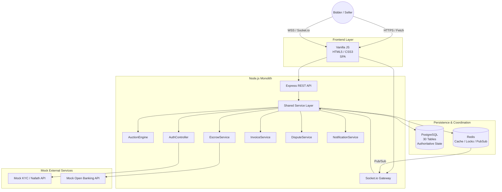

### 3.1 Containerization & Environment Consistency

Mezyad is containerized using Docker and Docker Compose. The development environment consists of the Node.js backend, PostgreSQL, Redis, and the frontend service, each in its own container.

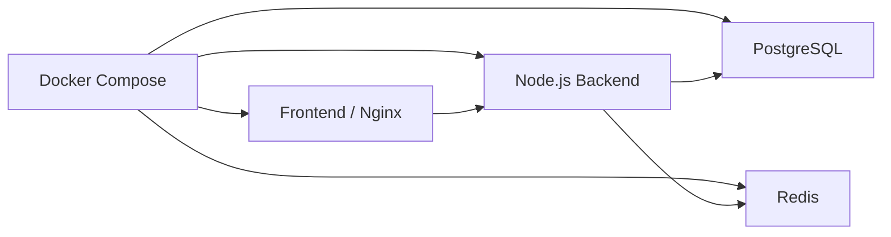

Docker Compose provides a reproducible environment across team members' machines and avoids dependency differences between local setups.

---

## 4. Backend Components & Class Design

The backend follows a service-oriented structure inside the Node.js monolith.

### 4.1 Core Classes

| Component | Responsibility |
|---|---|
| `AuthController` | Registration, login, session issuance, and identity verification |
| `AuctionEngine` | Auction lifecycle, bidding, closing, and anti-sniping |
| `EscrowService` | Escrow locking, release, and refunds |
| `WsHandler` | WebSocket authentication, auction rooms, and real-time events |
| `BidValidator` | Bid validation rules |
| `NotificationService` | User notifications and reconnection handling |
| `InvoiceService` | Invoice generation |
| `DisputeService` | Dispute lifecycle and admin resolution |

### 4.2 Class Diagram

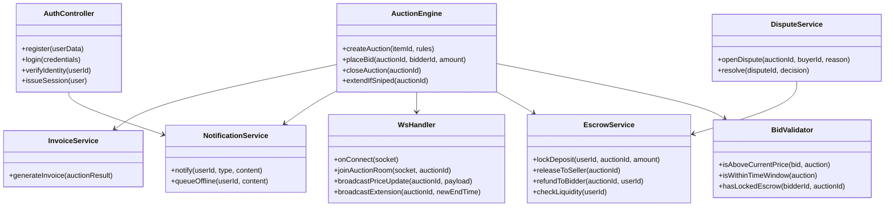

---

## 5. Database Design (Polyglot Persistence)

PostgreSQL is the authoritative, durable source of truth for all financial, business, and audit state. Redis is a real-time coordination layer — locks, caching, and Pub/Sub — and never decides whether a bid, payment, or escrow operation is accepted; that decision is made once, inside a PostgreSQL transaction.

### 5.1 PostgreSQL ER Diagram

> Note: this ERD has **not** been confirmed against the actual migrations/models — it should not be read as verified to match them. It is a best-effort reconstruction from what's documented in this README, and must be checked field-by-field against the real schema before final submission. Two names in particular need direct confirmation, since they're the kind of thing that tends to drift between docs and code: `authenticator_reviews` and `kyc_verifications`.

```mermaid
erDiagram
    users {
        uuid id PK
        string name
        string email
        string password_hash
        uuid role_id FK
        string notification_preferences
        datetime created_at
    }
    roles {
        uuid id PK
        string name
    }
    permissions {
        uuid id PK
        string name
    }
    role_permissions {
        uuid role_id PK, FK
        uuid permission_id PK, FK
    }
    kyc_verifications {
        uuid id PK
        uuid user_id FK
        string status
        string provider_reference
        datetime verified_at
    }
    user_sessions {
        uuid id PK
        uuid user_id FK
        string token_hash
        datetime expires_at
    }
    wallets {
        uuid id PK
        uuid user_id FK
        decimal available_balance
        decimal escrow_frozen_balance
    }
    bank_accounts {
        uuid id PK
        uuid user_id FK
        string iban
        string status
    }
    escrow_deposits {
        uuid id PK
        uuid auction_id FK
        uuid bidder_id FK
        decimal amount
        string status
    }
    transactions {
        uuid id PK
        uuid user_id FK
        uuid auction_id FK
        decimal amount
        string type
        string status
        datetime created_at
    }
    withdrawal_requests {
        uuid id PK
        uuid seller_id FK
        uuid bank_account_id FK
        decimal amount
        string status
        string rejection_reason
        datetime created_at
    }
    invoices {
        uuid id PK
        uuid auction_id FK
        uuid winner_id FK
        decimal subtotal
        decimal platform_fee
        decimal total
        string status
    }
    categories {
        uuid id PK
        string name
    }
    items {
        uuid id PK
        uuid seller_id FK
        uuid category_id FK
        string title
        string description
        string status
    }
    item_media {
        uuid id PK
        uuid item_id FK
        string media_url
        string media_type
    }
    item_documents {
        uuid id PK
        uuid item_id FK
        string document_url
        string document_type
    }
    appraisal_workflows {
        uuid id PK
        uuid item_id FK
        string status
        datetime submitted_at
        datetime completed_at
    }
    authenticator_reviews {
        uuid id PK
        uuid appraisal_id FK
        uuid reviewer_id FK
        string decision
        string notes
    }
    auctions {
        uuid id PK
        uuid item_id FK
        string status
        decimal starting_price
        decimal current_price
        datetime start_time
        datetime end_time
    }
    bids {
        uuid id PK
        uuid auction_id FK
        uuid bidder_id FK
        decimal amount
        string request_id
        datetime created_at
    }
    proxy_bids {
        uuid id PK
        uuid auction_id FK
        uuid bidder_id FK
        decimal maximum_amount
        string status
    }
    auction_extensions {
        uuid id PK
        uuid auction_id FK
        datetime previous_end_time
        datetime new_end_time
        datetime created_at
    }
    auction_watchers {
        uuid auction_id PK, FK
        uuid user_id PK, FK
    }
    auction_rules {
        uuid id PK
        uuid auction_id FK
        decimal minimum_increment
        decimal deposit_value
        string deposit_type
        integer anti_sniping_seconds
    }
    auction_results {
        uuid id PK
        uuid auction_id FK
        uuid winner_id FK
        decimal winning_amount
        datetime closed_at
    }
    secure_handovers {
        uuid id PK
        uuid auction_id FK
        uuid winner_id FK
        string token_hash
        datetime expires_at
        boolean is_scanned_and_released
    }
    inspection_appointments {
        uuid id PK
        uuid auction_id FK
        uuid buyer_id FK
        uuid seller_id FK
        datetime scheduled_at
        string status
    }
    disputes {
        uuid id PK
        uuid auction_id FK
        uuid opened_by FK
        string status
        string admin_decision
    }
    dispute_messages {
        uuid id PK
        uuid dispute_id FK
        uuid sender_id FK
        string content
        string evidence_url
        datetime created_at
    }
    event_store {
        uuid id PK
        uuid user_id FK
        uuid auction_id FK
        string event_type
        string payload
        datetime created_at
    }

    roles ||--o{ users : assigns
    roles ||--o{ role_permissions : contains
    permissions ||--o{ role_permissions : grants
    users ||--o{ kyc_verifications : verifies
    users ||--o{ user_sessions : owns
    users ||--|| wallets : owns
    users ||--o{ bank_accounts : owns
    users ||--o{ items : sells
    categories ||--o{ items : categorizes
    items ||--o{ item_media : contains
    items ||--o{ item_documents : contains
    items ||--|| appraisal_workflows : undergoes
    appraisal_workflows ||--o{ authenticator_reviews : contains
    users ||--o{ authenticator_reviews : performs
    items ||--o{ auctions : auctioned_as
    auctions ||--o{ bids : receives
    users ||--o{ bids : places
    auctions ||--o{ proxy_bids : has
    users ||--o{ proxy_bids : configures
    auctions ||--o{ auction_extensions : extends
    auctions ||--o{ auction_watchers : watched_by
    users ||--o{ auction_watchers : watches
    auctions ||--|| auction_rules : configured_by
    auctions ||--o{ escrow_deposits : requires
    users ||--o{ escrow_deposits : funds
    users ||--o{ transactions : owns
    auctions ||--o{ transactions : generates
    users ||--o{ withdrawal_requests : requests
    bank_accounts ||--o{ withdrawal_requests : receives
    auctions ||--|| auction_results : produces
    users ||--o{ auction_results : wins
    auctions ||--|| invoices : generates
    users ||--o{ invoices : receives
    auctions ||--|| secure_handovers : requires
    users ||--o{ secure_handovers : authorizes
    auctions ||--o{ inspection_appointments : schedules
    users ||--o{ inspection_appointments : attends
    auctions ||--o{ disputes : creates
    users ||--o{ disputes : opens
    disputes ||--o{ dispute_messages : contains
    users ||--o{ dispute_messages : sends
    users ||--o{ event_store : triggers
    auctions ||--o{ event_store : records
```

### 5.2 Database Tables

| # | Table | Purpose |
|---|---|---|
| 1 | `users` | User accounts |
| 2 | `roles` | Role definitions for access control |
| 3 | `permissions` | Individual permission definitions |
| 4 | `role_permissions` | Maps roles to permissions |
| 5 | `kyc_verifications` | Mock identity-verification records |
| 6 | `user_sessions` | Active login sessions |
| 7 | `wallets` | Available and escrow-frozen balances |
| 8 | `bank_accounts` | Linked bank accounts for withdrawals and liquidity checks |
| 9 | `escrow_deposits` | Individually-tracked locked deposit amounts |
| 10 | `transactions` | Ledger of every financial movement |
| 11 | `withdrawal_requests` | Seller payout requests and their approval status |
| 12 | `invoices` | Generated invoices, including fee breakdown |
| 13 | `categories` | Asset categories |
| 14 | `items` | Listed assets |
| 15 | `item_media` | Photos and media attached to a listing |
| 16 | `item_documents` | Supporting documents attached to a listing |
| 17 | `appraisal_workflows` | Human appraisal/approval steps for a listing |
| 18 | `authenticator_reviews` | Individual authenticator sign-offs within an appraisal |
| 19 | `auctions` | Auction records |
| 20 | `bids` | Individual bids placed |
| 21 | `proxy_bids` | Stored maximum proxy-bid limits |
| 22 | `auction_extensions` | Log of anti-sniping time extensions |
| 23 | `auction_watchers` | Users currently watching an auction |
| 24 | `auction_rules` | Per-auction configuration |
| 25 | `auction_results` | Final outcome of a closed auction |
| 26 | `secure_handovers` | Signed, time-bound handover QR tokens |
| 27 | `inspection_appointments` | Scheduled inspection/handover meetings |
| 28 | `disputes` | Raised disputes |
| 29 | `dispute_messages` | Dispute thread messages and evidence |
| 30 | `event_store` | Append-only audit trail |

### 5.3 Redis Design

Redis coordinates and caches; PostgreSQL decides and persists.

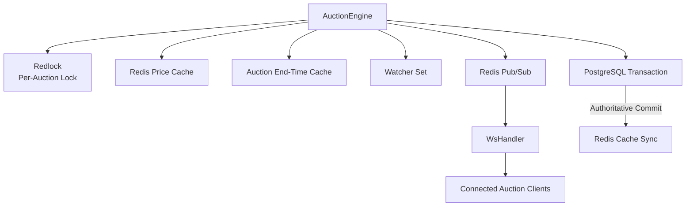

**Redis key schema:**

| Key Pattern | Type | Purpose |
|---|---|---|
| `auction:{id}:price` | String | Cached current highest accepted bid |
| `auction:{id}:lock` | String (TTL) | Per-auction Redlock |
| `auction:{id}:watchers` | Set | Current auction watchers |
| `auction:{id}:end_time` | String | Cached auction end time |
| `bid:{auctionId}:events` | Pub/Sub channel | Auction event broadcast |

**Bid critical path:**

```mermaid
flowchart LR
    Bid["Bid Arrives"]
    Lock["Acquire Redlock"]
    Cache["Preliminary Redis Check"]
    Validate["BidValidator"]
    PG["PostgreSQL Transaction"]
    Commit["Commit"]
    Update["Update Redis"]
    Publish["Pub/Sub"]
    Broadcast["WebSocket Broadcast"]
    Release["Release Lock"]
    Bid --> Lock
    Lock --> Cache
    Cache --> Validate
    Validate --> PG
    PG --> Commit
    Commit --> Update
    Update --> Publish
    Publish --> Broadcast
    Broadcast --> Release
```

- PostgreSQL remains the authoritative source for accepted state.
- If PostgreSQL fails before commit, the transaction rolls back and no accepted bid is ever published.
- If Redis fails or goes stale after PostgreSQL commits, it is treated as a desynchronized cache and rebuilt from PostgreSQL before the next bid is evaluated.

---

## 6. Sequence Diagrams

Mezyad is documented through eight core end-to-end flows covering identity, appraisal, funding, live bidding, settlement, handover, disputes, and withdrawal.

### Flow 1 — User Onboarding & Identity Verification

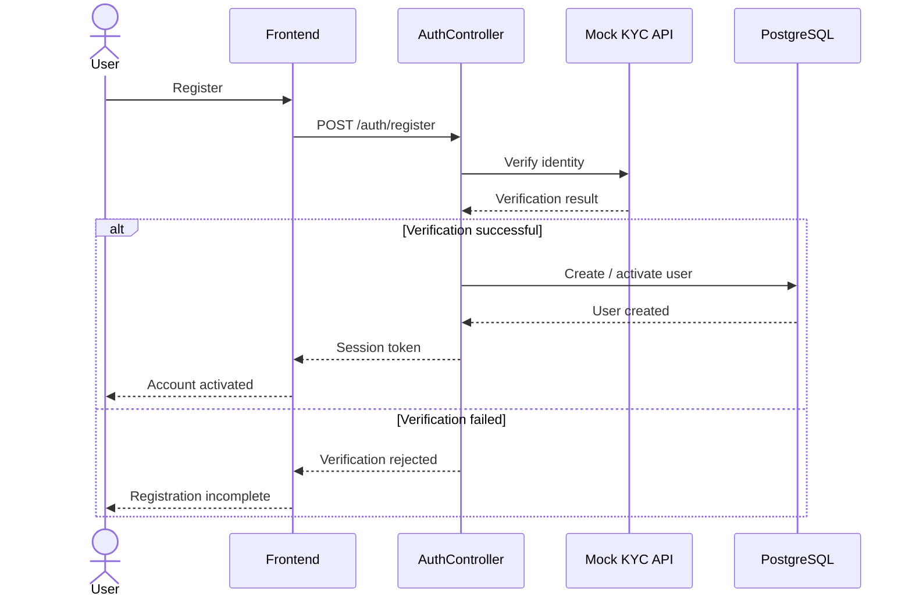

### Flow 2 — Item Listing & Appraisal Workflow

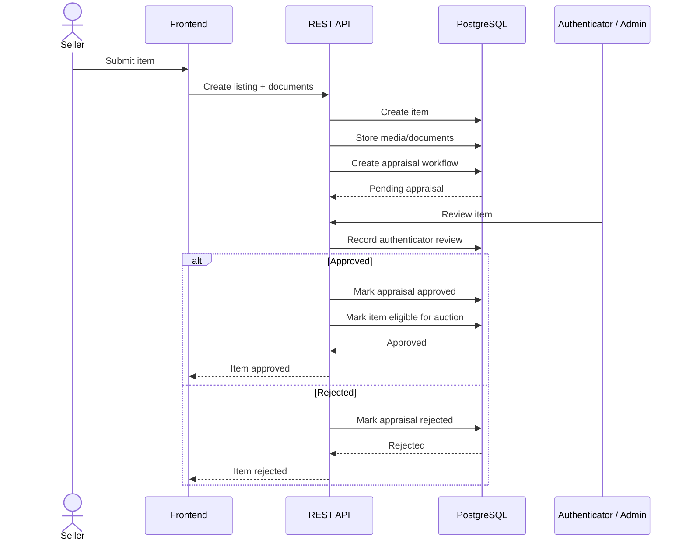

### Flow 3 — Open Banking & Escrow Funding Check

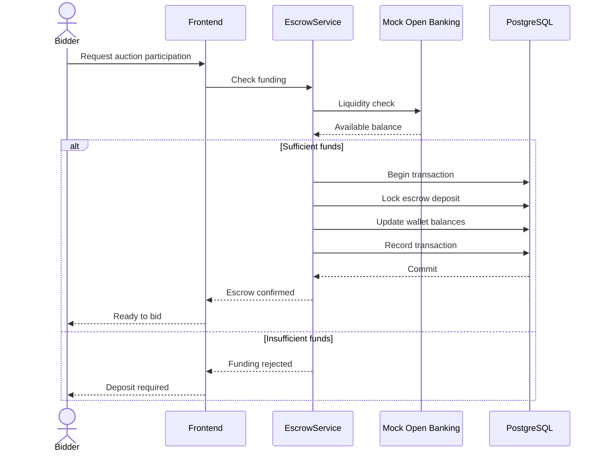

### Flow 4 — Live Bidding Engine ⭐

```mermaid
sequenceDiagram
    actor Bidder
    participant UI as Frontend
    participant WS as WsHandler
    participant Engine as AuctionEngine
    participant Redis as Redis
    participant Lock as Redlock
    participant Validator as BidValidator
    participant DB as PostgreSQL
    participant PubSub as Redis Pub/Sub
    actor Watchers as Other Watchers

    alt Manual bid
        Bidder->>UI: Place bid
        UI->>WS: bid:place + requestId
    else Proxy bid (auto-generated)
        Engine->>Engine: Detect bidder outbid within proxy limit
        Engine->>WS: bid:place + requestId (system-originated)
    end

    WS->>Engine: Process bid
    Engine->>Engine: Check requestId
    alt Duplicate requestId
        Engine-->>WS: Return original result
        WS-->>UI: Existing bid result
    else New request
        Engine->>Lock: Acquire auction lock
        alt Lock acquired
            Engine->>Redis: Read cached price (preliminary check only)
            Redis-->>Engine: Cached price
            Engine->>Validator: Validate bid
            Validator->>DB: Read authoritative auction state
            DB-->>Validator: Current state
            Validator-->>Engine: Validation result
            alt Valid bid
                Engine->>DB: BEGIN transaction
                Engine->>DB: Insert bid
                Engine->>DB: Update auction price
                opt Anti-sniping window
                    Engine->>DB: Extend end_time
                    DB-->>Engine: Extension committed
                end
                DB-->>Engine: COMMIT
                Engine->>Redis: Update price / end_time cache
                opt Redis update fails or is stale
                    Note over Engine,Redis: PostgreSQL stays authoritative;<br/>cache is rebuilt from PostgreSQL before the next bid
                end
                Engine->>PubSub: Publish bid event
                PubSub-->>WS: Bid accepted event
                WS-->>Watchers: bid:accepted
                WS-->>Bidder: bid:accepted
            else PostgreSQL validation / transaction failure
                Engine->>DB: ROLLBACK
                Engine-->>WS: Bid rejected
                WS-->>Bidder: bid:rejected
            end
            Engine->>Lock: Release
        else Lock unavailable
            Engine-->>WS: Retry / reject
            WS-->>Bidder: Bid not processed
        end
    end
```

**Close-vs-bid race** (same Redlock, whichever side wins the lock decides):

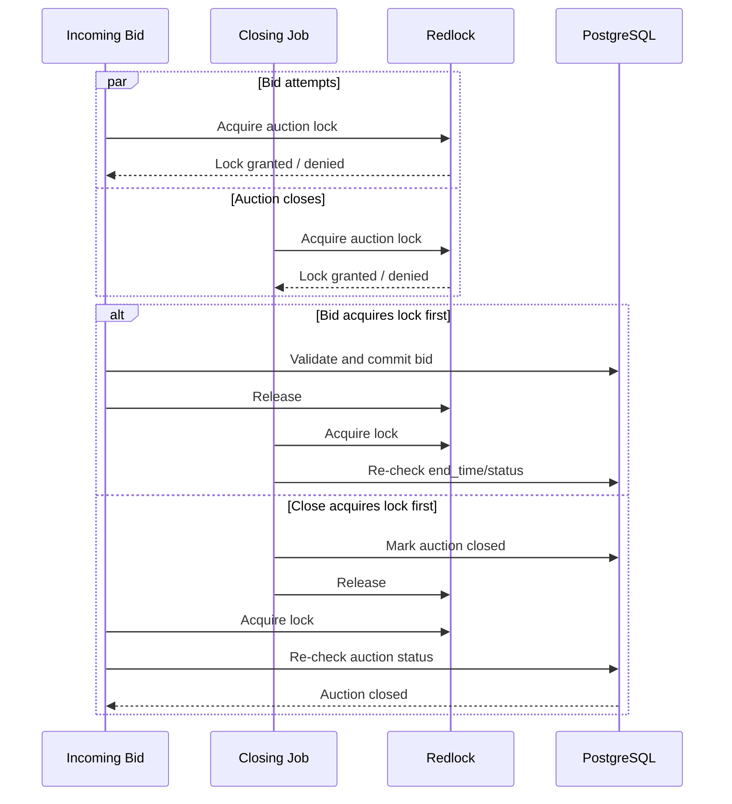

### Flow 5 — Auction Conclusion & Financial Settlement

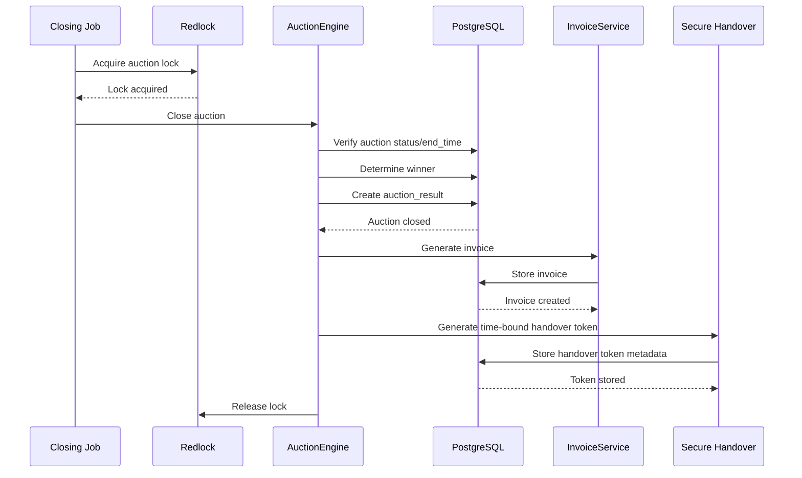

Uses the same per-auction Redlock as bidding; no blockchain or external settlement layer is involved.

### Flow 6 — Secure Time-Bound QR Handover

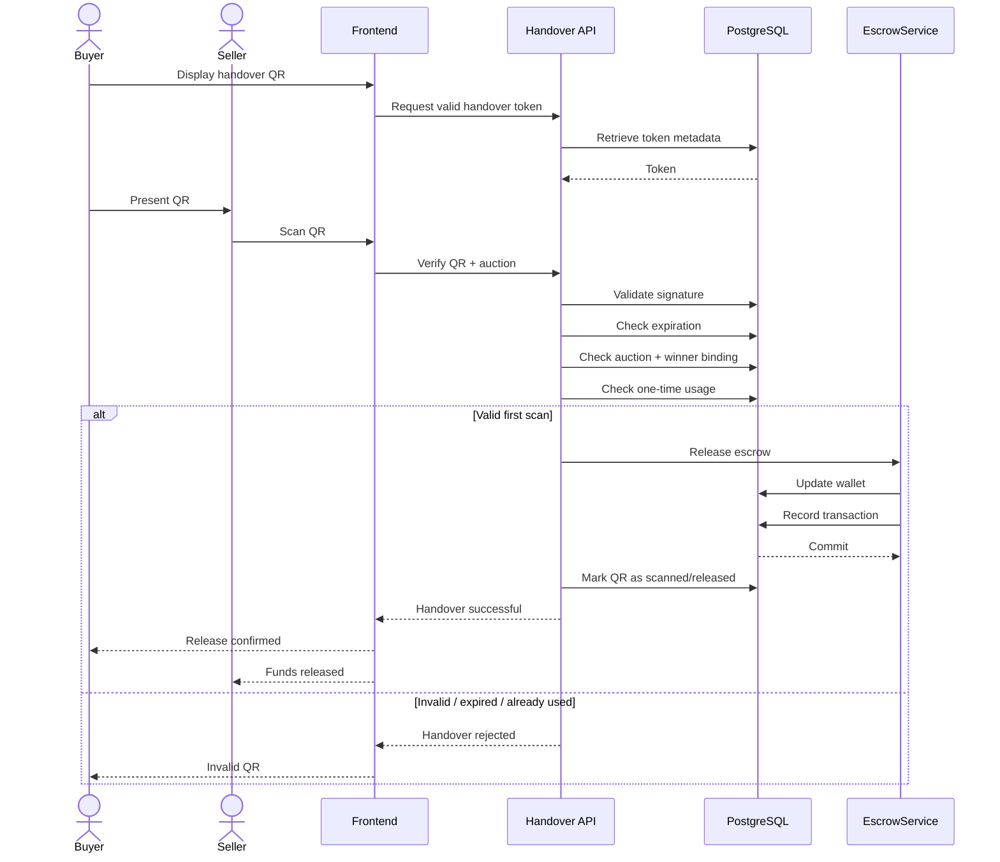

### Flow 7 — Dispute Resolution & Escrow Handling

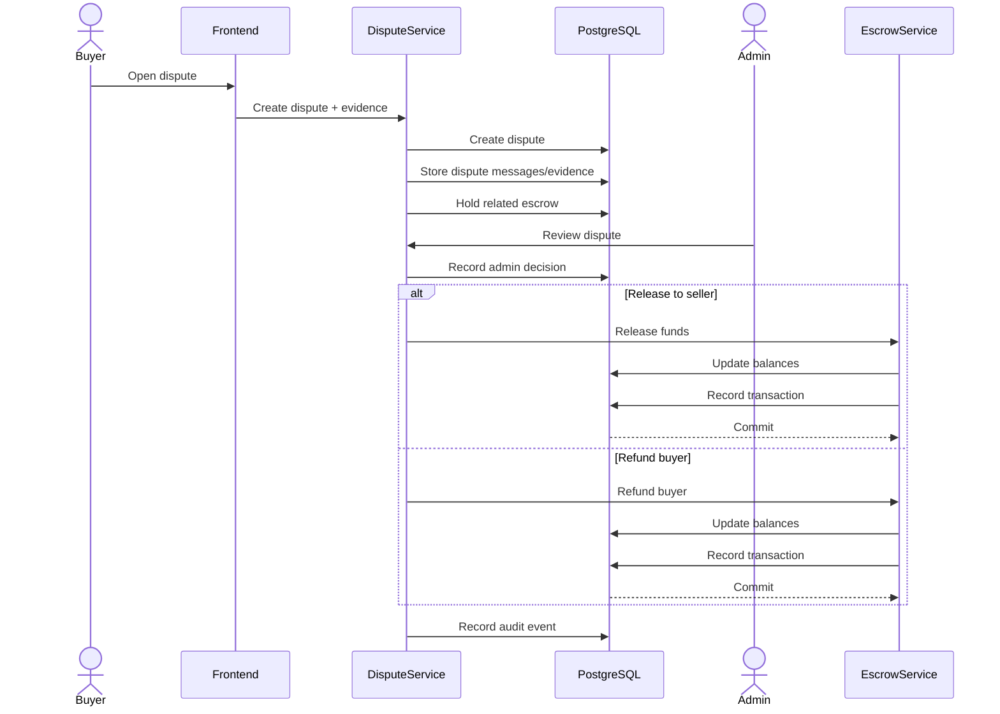

> Note: `Dispute->>DB: Hold related escrow` assumes there's an actual state or flag in code that blocks `EscrowService` from releasing funds while a dispute is open — this needs to be confirmed against the real implementation, not assumed from the diagram alone.

### Flow 8 — Seller Withdrawal Request & Admin Approval

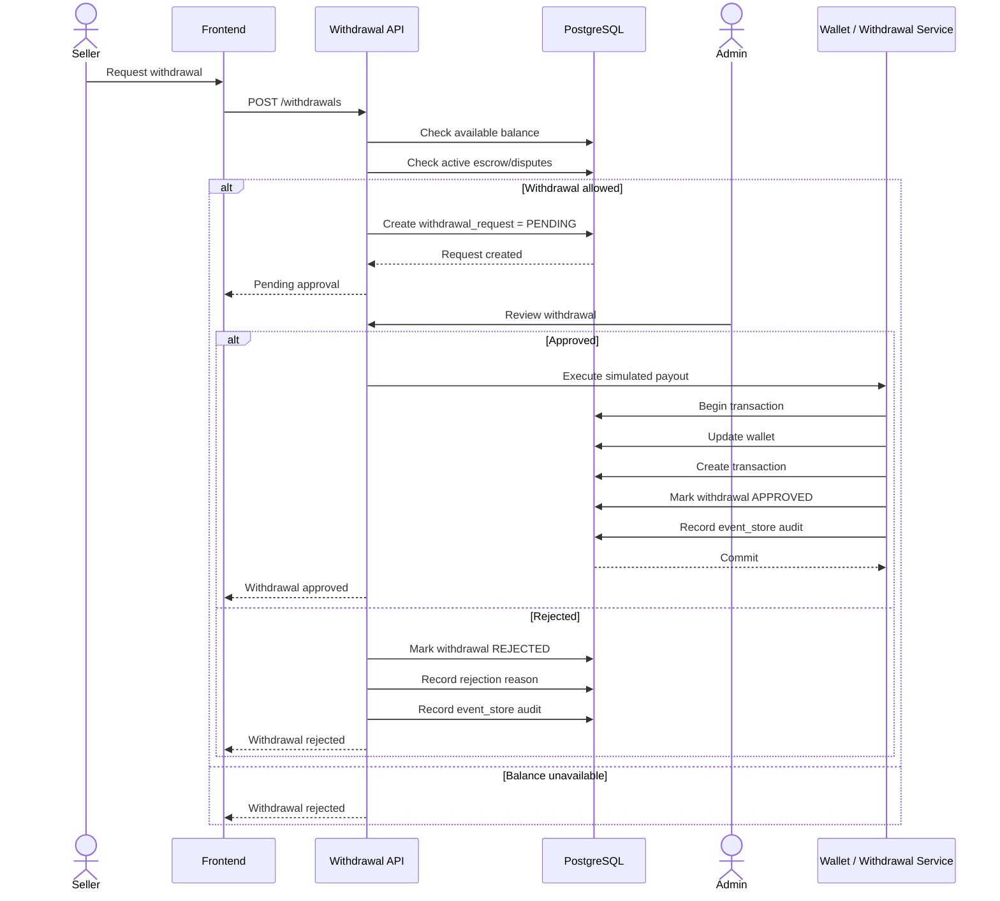

---

## 7. API Specifications

### 7.1 REST vs. WebSocket

Mezyad uses REST for transactional operations and WebSocket events for time-sensitive auction operations.

| Endpoint | Method | Description |
|---|---|---|
| `/api/v1/auth/register` | POST | Register user and trigger mock KYC |
| `/api/v1/auth/login` | POST | Authenticate user |
| `/api/v1/items` | POST | Create item listing |
| `/api/v1/escrow/deposit` | POST | Run liquidity check and lock escrow |
| `/api/v1/auctions/{id}` | GET | Retrieve auction details |
| `/api/v1/handovers/verify-qr` | POST | Verify handover QR |
| `/api/v1/withdrawals` | POST | Create withdrawal request |

**WebSocket events:**

| Event | Purpose |
|---|---|
| `bid:place` | Submit a bid |
| `bid:accepted` | Accepted bid broadcast |
| `bid:rejected` | Rejected bid response |
| `auction:extended` | Anti-sniping extension |
| `auction:closed` | Auction closure event |

**Idempotency:** every `bid:place` event carries a client-generated `requestId`, which is the sole mechanism used to detect duplicate bid submissions. Bid amount is never used as a duplicate identifier, since two legitimate bids may share the same amount.

### 7.2 Mock External Services

| Service | Simulates | Purpose |
|---|---|---|
| Mock KYC / Nafath API | National identity verification | Simulates identity verification |
| Mock Open Banking API | Proof of funds / liquidity | Simulates financial verification |

Both services follow internal integration contracts so their implementations can later be replaced without changing downstream business logic.

---

## 8. SCM and QA Plans

### 8.1 Implementation Tiers

**Tier A — Core MVP:** WebSocket bidding, PostgreSQL, Redis, Redlock, escrow, full auction lifecycle, anti-sniping, mock KYC, appraisal workflow, secure QR handover.

**Tier B — Differentiation:** proxy bidding, dispute resolution, withdrawal requests, notification delivery and reconnection handling, admin moderation, `requestId` idempotency, Redis/PostgreSQL reconciliation.

### 8.2 Source Control Management

- GitHub
- `main` — stable branch
- `development` — integration branch
- `feature/*` — feature branches
- Pull request review required before merging

### 8.3 Quality Assurance

**Unit testing**, focused on `BidValidator` and `AuctionEngine`: bid validation, concurrent bidding, Redlock behavior, close-vs-bid race, `requestId` idempotency, PostgreSQL rollback behavior.

**Integration testing** — all eight flows tested end to end: user onboarding, item appraisal, escrow funding, live bidding, auction settlement, secure handover, dispute resolution, seller withdrawal.

**Failure & recovery testing:** PostgreSQL transaction rollback, Redis cache desynchronization and reconstruction, duplicate request handling, auction closing race, invalid/expired QR, double QR scan prevention, withdrawal rejection.

---

## 9. Future Enhancements

The following are intentionally outside the current MVP, and may be explored in future versions without affecting the current architecture:

- Sealed-bid auctions
- AI-assisted price estimation
- AI concierge
- Blockchain-backed digital ownership
