# Stage 3 Report: Technical Documentation (Mezyad / مِزياد)

This document provides the comprehensive technical blueprint for the "Mezyad" platform, detailing user stories, system architecture, database design, sequence diagrams, API specifications, and quality assurance plans.

---

## 1. User Stories & Mockups

### Prioritized User Stories (MoSCoW)

| Priority | Role | User Story |
| :--- | :--- | :--- |
| **Must Have** | **Premium Bidder** | As a premium bidder, I want to view real-time auction price updates instantly via WebSockets without refreshing the page, so that I never miss a bidding opportunity in the final seconds. |
| **Must Have** | **Seller** | As a seller, I want to upload high-value assets and attach verification documents, so that they can undergo the mandatory appraisal workflow before going live. |
| **Must Have** | **System / Escrow** | As the system, I want to automatically lock a security deposit in the user's virtual wallet before granting entry to the live bidding room, to completely eliminate fake bids. |
| **Should Have** | **Admin** | As an admin, I want a live moderation dashboard to oversee active auctions, review listings, and suspend suspicious activities instantly. |
| **Should Have** | **Winner** | As a winning bidder, I want an automated digital sales contract and tax invoice generated in PDF format immediately after auction closure. |

### UI Mockups & Design Methodology
* **Design System:** The user interface follows a modern, premium "Dark Mode" aesthetic using custom CSS styling, optimized for high-net-worth individuals and high-end asset presentation.
* **Architecture Pattern:** The frontend relies on Vanilla JavaScript, HTML5, and CSS3 structured as a Single Page Application (SPA)-like experience. It utilizes the asynchronous Fetch API for REST communication and Socket.io client listeners for instant DOM updates during high-stakes bidding wars.

---

## 2. System Architecture

The application uses a robust multi-tier architecture designed for high concurrency, sub-second latency, and strict transactional security.

Below is the system architecture flowchart illustrating the complete data flow from the client interface down to the databases and external integrations:

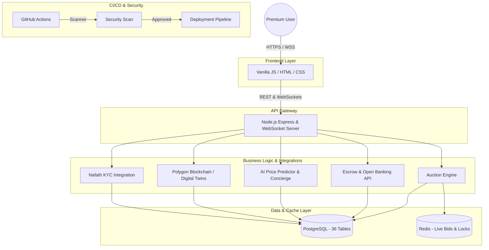

---

## 3. Database Design & Components

### 3.1 Backend Components
* **Bidding Engine Module:** Manages the Anti-Sniper logic, dynamic increments, and proxy bidding.
* **Escrow Ledger Module:** Handles the freezing, deduction, and releasing of virtual security deposits.
* **Event Sourcing Adapter:** Documents every critical system action into the `event_store` for immutable auditing and shill-bidding detection.

### 3.2 Database Design (ER Diagram)

The relational schema is deeply normalized into 36 tables covering IAM, Ledger, Catalog, Auction Engine, Handover, and Event Sourcing. It relies on PostgreSQL for ACID persistence, while high-frequency read/writes (live bids, locks) are offloaded to Redis.

```mermaid
erDiagram
    %% 1. IAM & Security Module
    users {
        uuid id PK
        varchar full_name
        varchar email
        varchar phone
        varchar password_hash
        boolean is_2fa_enabled
        varchar two_factor_secret
        uuid role_id FK
    }
    roles {
        uuid id PK
        varchar name
    }
    permissions {
        uuid id PK
        varchar action_name
    }
    role_permissions {
        uuid role_id FK
        uuid permission_id FK
    }
    kyc_nafath_verifications {
        uuid id PK
        uuid user_id FK
        varchar national_id
        varchar status
        timestamp verified_at
    }
    user_badges {
        uuid id PK
        uuid user_id FK
        varchar badge_type
        timestamp awarded_at
    }

    %% 2. Ledger & Escrow Module
    wallets {
        uuid id PK
        uuid user_id FK
        decimal available_balance
        decimal escrow_frozen_balance
    }
    bank_accounts {
        uuid id PK
        uuid user_id FK
        varchar iban
        boolean is_open_banking_verified
        decimal available_liquidity
        timestamp last_funds_check_date
    }
    escrow_deposits {
        uuid id PK
        uuid user_id FK
        uuid auction_id FK
        decimal amount
        varchar status
    }
    transactions {
        uuid id PK
        uuid wallet_id FK
        decimal amount
        varchar transaction_type
        timestamp created_at
    }
    platform_fees {
        uuid id PK
        uuid category_id FK
        decimal fee_percentage
    }
    invoices {
        uuid id PK
        uuid user_id FK
        uuid auction_id FK
        varchar pdf_url
        decimal tax_amount
    }

    %% 3. Catalog & Items Module
    categories {
        uuid id PK
        varchar name
    }
    items {
        uuid id PK
        uuid seller_id FK
        uuid category_id FK
        text title
        text description
        decimal starting_price
        jsonb dynamic_attributes
        varchar smart_contract_address
        varchar digital_twin_url
    }
    item_media {
        uuid id PK
        uuid item_id FK
        varchar media_url
        varchar media_type
    }
    item_documents {
        uuid id PK
        uuid item_id FK
        varchar document_url
        text ai_summary_text
    }
    appraisal_workflows {
        uuid id PK
        uuid item_id FK
        varchar status
    }
    authenticators_reviews {
        uuid id PK
        uuid appraisal_id FK
        uuid evaluator_id FK
        text notes
        boolean is_authentic
    }

    %% 4. Auction Engine Module
    auctions {
        uuid id PK
        uuid item_id FK
        timestamp start_time
        timestamp end_time
        decimal current_price
        varchar auction_type
        jsonb auction_rules
    }
    private_room_invites {
        uuid id PK
        uuid auction_id FK
        uuid invited_user_id FK
        varchar access_code
        boolean is_used
    }
    bids {
        uuid id PK
        uuid auction_id FK
        uuid bidder_id FK
        decimal amount
        timestamp created_at
    }
    proxy_bids {
        uuid id PK
        uuid auction_id FK
        uuid bidder_id FK
        decimal max_limit_amount
    }
    auction_extensions {
        uuid id PK
        uuid auction_id FK
        int extended_by_minutes
        varchar reason
    }
    auction_watchers {
        uuid id PK
        uuid auction_id FK
        uuid user_id FK
    }
    sealed_bids {
        uuid id PK
        uuid auction_id FK
        uuid bidder_id FK
        varchar encrypted_amount
    }

    %% 5. Handover & Disputes Module
    auction_results {
        uuid id PK
        uuid auction_id FK
        uuid winner_id FK
        decimal final_price
        decimal platform_commission
    }
    secure_handovers {
        uuid id PK
        uuid auction_id FK
        varchar dynamic_qr_hash
        boolean is_scanned_and_released
    }
    inspection_appointments {
        uuid id PK
        uuid auction_id FK
        varchar location_lat_lng
        timestamp scheduled_time
    }
    disputes {
        uuid id PK
        uuid auction_id FK
        varchar status
        text resolution_decision
    }
    dispute_messages {
        uuid id PK
        uuid dispute_id FK
        uuid sender_id FK
        text message
        varchar attachment_url
    }

    %% 6. AI & Event Sourcing Module
    concierge_chats {
        uuid id PK
        uuid user_id FK
        text prompt_text
        text ai_response
        varchar executed_action
    }
    ai_price_predictions {
        uuid id PK
        uuid item_id FK
        decimal predicted_fair_value
        decimal confidence_score
    }
    event_store {
        uuid id PK
        uuid aggregate_id
        varchar event_type
        jsonb payload
        varchar ip_address
        timestamp created_at
    }
    notifications_log {
        uuid id PK
        uuid user_id FK
        varchar channel
        text content
        boolean is_read
    }

    %% 7. Ratings & Withdrawals
    user_reviews {
        uuid id PK
        uuid reviewer_id FK
        uuid reviewee_id FK
        uuid auction_id FK
        int rating_score
        text comment
        timestamp created_at
    }
    withdrawal_requests {
        uuid id PK
        uuid wallet_id FK
        uuid bank_account_id FK
        decimal amount
        varchar status
        timestamp requested_at
    }

    %% Relationships
    roles ||--o{ users : "has"
    roles ||--o{ role_permissions : "includes"
    permissions ||--o{ role_permissions : "granted_to"
    users ||--o{ kyc_nafath_verifications : "verifies"
    users ||--o{ user_badges : "earns"

    users ||--|| wallets : "owns"
    users ||--o{ bank_accounts : "links"
    users ||--o{ escrow_deposits : "makes"
    auctions ||--o{ escrow_deposits : "requires"
    wallets ||--o{ transactions : "logs"
    categories ||--o| platform_fees : "determines"
    users ||--o{ invoices : "receives"
    auctions ||--o{ invoices : "generates"

    categories ||--o{ items : "categorizes"
    users ||--o{ items : "sells"
    items ||--o{ item_media : "contains"
    items ||--o{ item_documents : "attached_to"
    items ||--o| appraisal_workflows : "undergoes"
    appraisal_workflows ||--o{ authenticators_reviews : "reviewed_by"
    users ||--o{ authenticators_reviews : "evaluates"

    items ||--o| auctions : "listed_as"
    auctions ||--o{ private_room_invites : "invites"
    users ||--o{ private_room_invites : "receives_invite"
    auctions ||--o{ bids : "receives"
    users ||--o{ bids : "places"
    auctions ||--o{ proxy_bids : "has_proxy"
    users ||--o{ proxy_bids : "sets_proxy"
    auctions ||--o{ auction_extensions : "triggers"
    auctions ||--o{ auction_watchers : "watched_by"
    users ||--o{ auction_watchers : "watches"
    auctions ||--o{ sealed_bids : "has_sealed"
    users ||--o{ sealed_bids : "places_sealed"

    auctions ||--o| auction_results : "concludes_with"
    users ||--o{ auction_results : "wins"
    auctions ||--o| secure_handovers : "requires_handover"
    auctions ||--o| inspection_appointments : "schedules"
    auctions ||--o{ disputes : "has_disputes"
    disputes ||--o{ dispute_messages : "contains_messages"
    users ||--o{ dispute_messages : "sends"

    users ||--o{ concierge_chats : "interacts_with"
    items ||--o| ai_price_predictions : "predicted_by"
    users ||--o{ notifications_log : "notified_via"

    users ||--o{ user_reviews : "writes_review"
    users ||--o{ user_reviews : "receives_review"
    auctions ||--o| user_reviews : "results_in_review"

    wallets ||--o{ withdrawal_requests : "requests_withdrawal"
    bank_accounts ||--o{ withdrawal_requests : "transferred_to"
```

### 3.3 Complete Table Inventory (36 Tables)

The schema is intentionally partitioned into seven functional modules. This separation keeps ownership boundaries clean between the identity/compliance domain, the money-movement domain, and the auction domain — which is essential in a system where a bug in one module (e.g., catalog) must never be able to corrupt the integrity of another (e.g., the ledger).

**Module 1 — IAM & Security** (6 tables)
Handles who a user is, what they are allowed to do, and how their identity was verified. This module is the trust anchor for every other module: no wallet, bid, or listing can exist without a verified identity behind it.
1. `users` — Core identity record, credentials, and 2FA secrets.
2. `roles` — Named role definitions (Bidder, Seller, Admin, Evaluator, FinOps).
3. `permissions` — Discrete, granular actions that can be granted.
4. `role_permissions` — Many-to-many mapping between roles and permissions (RBAC).
5. `kyc_nafath_verifications` — Stores the outcome of Nafath national identity verification.
6. `user_badges` — Trust/status badges awarded after verification or performance milestones.

**Module 2 — Ledger & Escrow** (6 tables)
The financial core of the platform. Every SAR that moves — whether frozen as a deposit, deducted as a fee, or transferred as a payout — is logged here, ensuring auditability and regulatory compliance for a platform handling high-value transactions.
7. `wallets` — Per-user internal balance, split between available and escrow-frozen funds.
8. `bank_accounts` — Linked IBANs and Open Banking verification state.
9. `escrow_deposits` — Individual deposit holds tied to a specific auction.
10. `transactions` — Immutable ledger of every wallet debit/credit.
11. `platform_fees` — Commission rules per category.
12. `invoices` — Generated tax invoices and PDF records for closed auctions.

**Module 3 — Catalog & Items** (6 tables)
Governs how an asset enters the platform and earns the right to be auctioned. Because assets here are high-value (real estate, vehicles, rare collectibles), nothing reaches a bidding room without passing through a documented appraisal trail.
13. `categories` — Asset category taxonomy, used to drive fee rules and search.
14. `items` — The asset record itself, including AI-generated attributes and on-chain references.
15. `item_media` — Photos, videos, and 3D scans attached to an item.
16. `item_documents` — Ownership deeds, certificates, and other supporting documents.
17. `appraisal_workflows` — Tracks an item's progress through the human-review pipeline.
18. `authenticators_reviews` — Individual evaluator sign-offs and authenticity notes.

**Module 4 — Auction Engine** (7 tables)
The real-time transactional heart of the system. These tables back the logic that must remain correct under extreme concurrency — dozens of bidders competing for the same asset in the same second.
19. `auctions` — Master auction record: timing, current price, and rule set.
20. `private_room_invites` — Access-gated entry to closed, invite-only bidding rooms.
21. `bids` — The append-only history of every bid ever placed.
22. `proxy_bids` — Stored maximum limits for automatic proxy bidding.
23. `auction_extensions` — Log of Anti-Sniper time extensions and their trigger reason.
24. `auction_watchers` — Users following an auction without necessarily bidding.
25. `sealed_bids` — Encrypted, blind-bid entries for sealed-bid auction formats.

**Module 5 — Handover & Disputes** (5 tables)
Covers everything that happens *after* the gavel falls: proving delivery happened, and giving both parties a formal channel to resolve disagreements before funds are finally released.
26. `auction_results` — Final outcome, winner, and commission breakdown per auction.
27. `secure_handovers` — Dynamic QR-based proof-of-delivery records.
28. `inspection_appointments` — Scheduled in-person inspection/meetup details.
29. `disputes` — Formal dispute case records and resolution status.
30. `dispute_messages` — Threaded evidence and communication within a dispute.

**Module 6 — AI & Event Sourcing** (4 tables)
Provides both the intelligence layer (pricing, natural-language actions) and the immutable audit trail that regulators and fraud investigators rely on. Event sourcing here is what makes shill-bidding and collusion detectable after the fact.
31. `concierge_chats` — Natural-language commands sent to the AI assistant and its resulting actions.
32. `ai_price_predictions` — Model-generated fair-value estimates and confidence scores per item.
33. `event_store` — Append-only, immutable log of every state-changing action in the system, with IP address for forensic traceability.
34. `notifications_log` — Delivery record of every notification sent, across every channel.

**Module 7 — Ratings & Withdrawals** (2 tables)
Closes the trust loop (reputation) and governs the final, most sensitive financial action a user can take: pulling real money out of the platform.
35. `user_reviews` — Post-auction ratings and feedback between counterparties.
36. `withdrawal_requests` — Requests to move funds from the internal wallet to an external bank account, subject to compliance review.

---

## 4. Sequence Diagrams

### 1. User Onboarding & Nafath KYC
**Role:** Illustrates the new user registration flow, connecting to the "Nafath" platform for identity verification, granting the premium badge, and securely storing the data.

```mermaid
sequenceDiagram
    autonumber
    actor User as Premium User
    participant API as Node.js Backend
    participant Nafath as Nafath API
    participant DB as PostgreSQL

    User->>API: Submit National ID & Phone
    API->>Nafath: Init Authentication Request
    Nafath-->>User: Prompt Approval in Nafath App
    User->>Nafath: Approve Request
    Nafath-->>API: Return Success Webhook & User Data

    rect rgb(40, 44, 52)
        Note over API, DB: Secure Storage Phase
        API->>DB: Insert into users & kyc_nafath_verifications
        API->>DB: Insert into user_badges (Award Premium Badge)
    end

    API-->>User: Registration Complete (Premium Status Active)
```

### 2. Item Listing and AI Appraisal
**Role:** Represents the seller's journey in uploading an item, summarizing complex documents via AI, and routing it to a human evaluator for final approval before publishing.

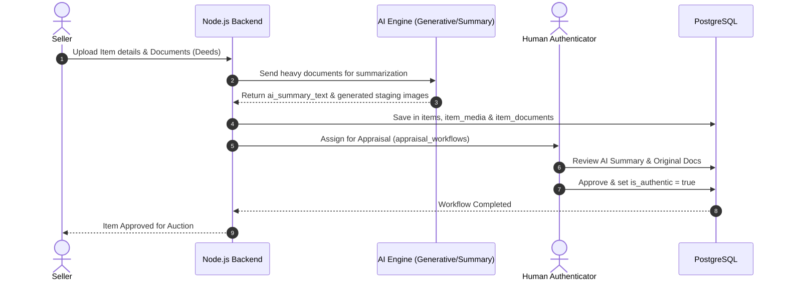

### 3. Open Banking & Escrow Processing
**Role:** Explains the mechanism of verifying the bidder's financial solvency via open banking, and freezing the escrow amount in their wallet to allow entry into the closed room.

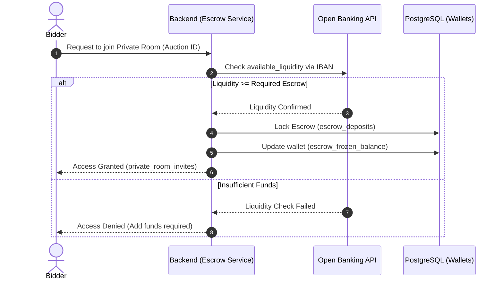

### 4. Live Bidding Engine
**Role:** Demonstrates how the system handles live bids using Redis to prevent race conditions (Locks) and broadcasts the new price to all users in a fraction of a second.

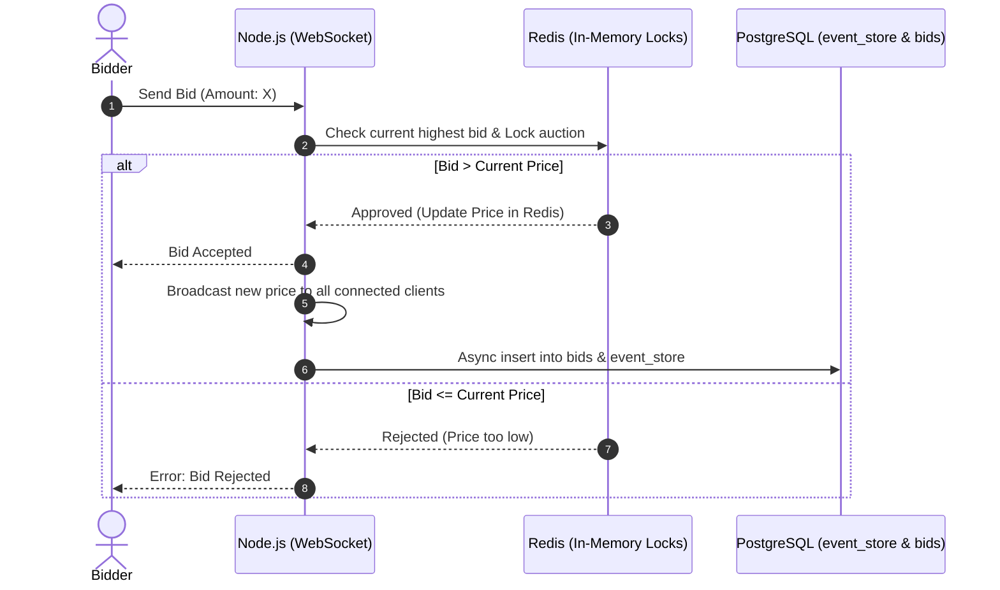

### 5. Auction Conclusion and Blockchain Integration
**Role:** Shows the automated procedures when time expires, from issuing invoices and registering the winner, to creating a digital ownership contract (Digital Twin) on the blockchain.

```mermaid
sequenceDiagram
    autonumber
    participant Cron as Job Scheduler
    participant API as Node.js Backend
    participant Web3 as Polygon Blockchain
    participant DB as PostgreSQL
    actor Winner

    Cron->>API: Trigger End Auction (Time Expired)
    API->>DB: Fetch highest bid & Winner ID
    API->>DB: Insert into auction_results & invoices

    rect rgb(40, 44, 52)
        Note over API, Web3: Digital Twin Minting
        API->>Web3: Deploy Smart Contract (Transfer Ownership)
        Web3-->>API: Return digital_twin_url & tx_hash
        API->>DB: Update items (smart_contract_address)
    end

    API-->>Winner: Notify Win & Send Invoice (PDF)
```

### 6. Secure Handover via QR Code
**Role:** Illustrates the face-to-face meeting protocol between buyer and seller, where a dynamic QR code is scanned to release the held funds and transfer them to the seller.

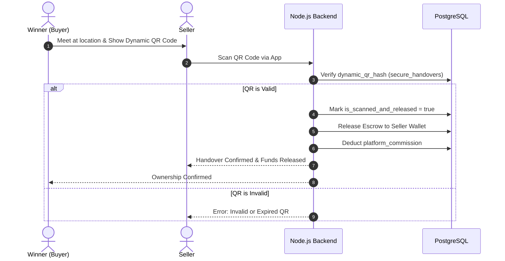

### 7. Auto Proxy Bidding
**Role:** Displays how the system automatically bids on behalf of a user who set a secret maximum limit, instantly outbidding new competitors.

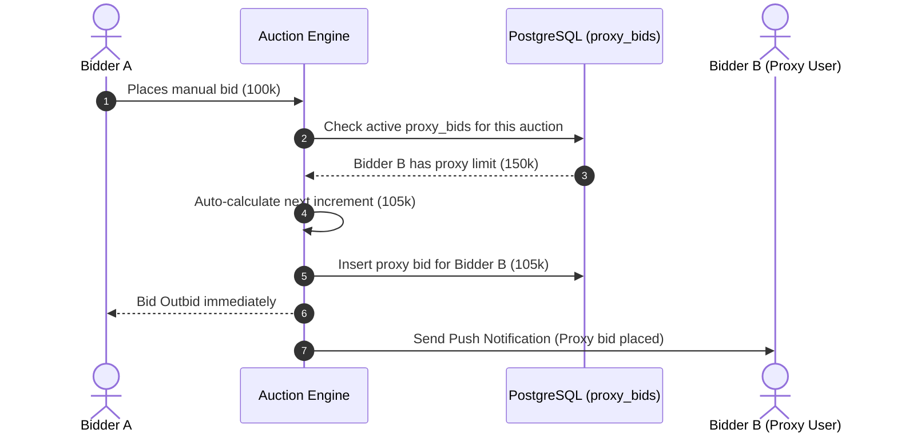

### 8. Anti-Sniper Auction Extension
**Role:** Clarifies the system's smart intervention when a bid occurs in the final seconds, automatically extending the auction time to ensure fairness and maximize profit.

```mermaid
sequenceDiagram
    autonumber
    actor Sniper
    participant Engine as Auction Engine (Redis/Node)
    participant DB as PostgreSQL (auction_extensions)
    participant Clients as All Watchers (WS)

    Sniper->>Engine: Places bid (Time remaining < 15s)
    Engine->>Engine: Accept Bid

    rect rgb(40, 44, 52)
        Note over Engine, DB: Anti-Sniper Protocol Triggered
        Engine->>Engine: Extend end_time by 3 minutes
        Engine->>DB: Log to auction_extensions
    end

    Engine-->>Clients: Broadcast (New Price + Timer Extended!)
```

### 9. Dispute Resolution
**Role:** The process of opening a dispute ticket by the buyer, freezing funds until the admin reviews evidence and issues a decision to refund or complete the sale.

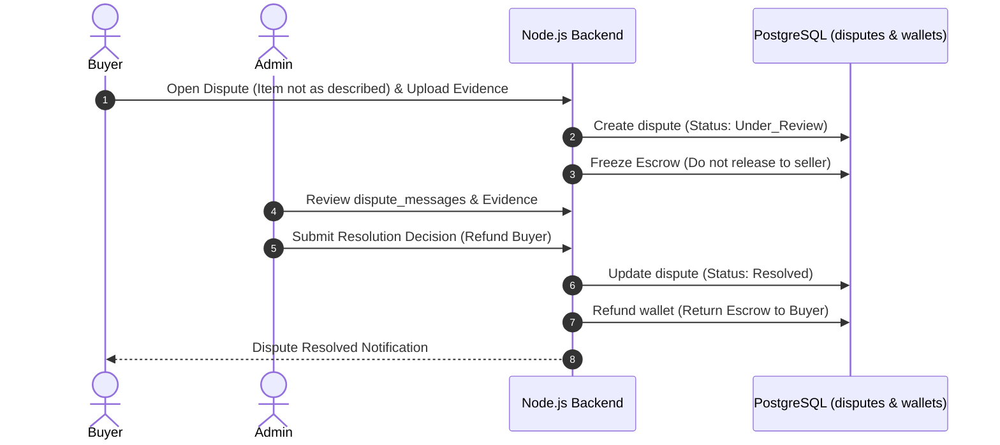

### 10. AI Concierge Assistant
**Role:** Shows how the AI agent analyzes text commands from a premium user and converts them into actual programmatic operations (like executing a bid on their behalf).

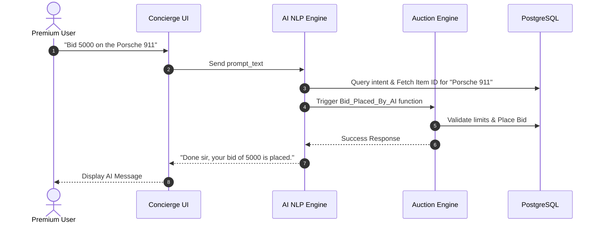

### 11. Withdrawal Requests and Compliance
**Role:** The financial security procedures when requesting large withdrawals from the platform, passing through account admin review and transferring to the bank account.

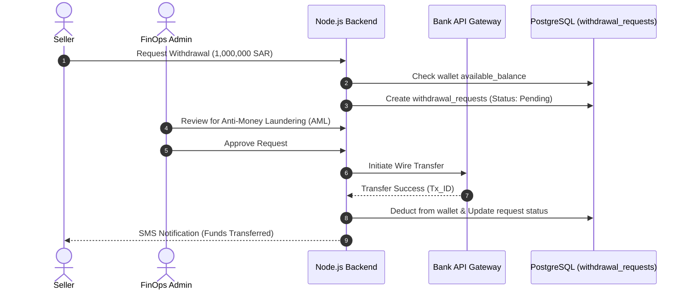

---

## 5. API Specifications

Mezyad's API surface is deliberately split into two tiers: **external integrations**, which offload regulated or specialized functions to trusted third parties, and **internal endpoints**, which encapsulate the platform's own core business logic. This separation matters for both security and compliance — Mezyad never re-implements identity verification, banking checks, or blockchain settlement itself; it consumes these as certified services and focuses its own engineering effort on the auction domain, where it must be authoritative.

### 5.1 External APIs — Why Each One Is Non-Negotiable

**Nafath Simulation API (Identity & KYC)**
Nafath is the national digital identity layer. By routing every registration through it, Mezyad ensures that a `users` record can never exist without a government-verified real identity behind it. For a marketplace trading in real estate, vehicles, and other high-value assets, this closes the door on anonymous accounts — the single biggest enabler of fraud, money laundering, and shill bidding in traditional online auctions. The KYC outcome is persisted in `kyc_nafath_verifications`, giving compliance teams and auditors a permanent, queryable record of *when* and *how* each user's identity was confirmed.

**Open Banking API (Proof of Funds)**
This integration is the platform's primary defense against fake bidding. Before a user is admitted to a private bidding room, the Open Banking API is queried to confirm `available_liquidity` against the account's IBAN. This means a bidder cannot simply *claim* to have SAR 2,000,000 available — the claim is cryptographically and institutionally verified by their own bank in real time. Only after this check passes does the escrow engine proceed to freeze funds (`escrow_deposits`, `wallets.escrow_frozen_balance`). Without this step, a bad actor could drive up an auction's price with bids they have no intention or ability to honor, which is precisely the failure mode this API is designed to eliminate.

**Polygon Blockchain API (Digital Twin & Ownership Authenticity)**
When a high-value auction concludes, ownership transfer is more than a database row update — it is minted as an immutable, publicly verifiable record on the Polygon blockchain. This "digital twin" (referenced via `items.smart_contract_address` and `items.digital_twin_url`) provides a tamper-proof provenance trail: any future buyer, insurer, or auditor can independently verify who owned the asset and when the transfer legally occurred, without trusting Mezyad's own database. This is particularly critical for rare or collectible assets, where provenance fraud is historically one of the largest sources of dispute.

### 5.2 Internal API Endpoints — Business Logic Behind Each Call

| Endpoint Path | HTTP Method | Request Body / Query | Response Format | Business Logic |
|---|---|---|---|---|
| `/api/v1/auctions/{id}/bid` | POST | `{"amount": 1500000}` | JSON | The single most concurrency-sensitive endpoint on the platform. Before the bid is accepted, the engine acquires a **Redis Redlock** (a distributed lock) scoped to the auction ID. This guarantees that even if two bids arrive within the same millisecond from different application server instances, they are serialized rather than processed in parallel — preventing the classic race condition where two users are both told "you are the highest bidder" for the same amount. Only after the lock is acquired is the current price compared, the new price broadcast over WebSockets, and the bid asynchronously persisted to `bids` and `event_store`. |
| `/api/v1/escrow/deposit` | POST | `{"amount": 5000, "auction_id": "uuid"}` | JSON | Executes an atomic, transactional fund movement: debits `wallets.available_balance` and credits `wallets.escrow_frozen_balance` within a single database transaction, so a server crash mid-operation can never leave funds in an inconsistent state (money "disappearing" or being double-counted). A corresponding `escrow_deposits` row is created as the auditable record of the hold. |
| `/api/v1/items/{id}` | GET | None | JSON | Returns the full item payload, including the `jsonb dynamic_attributes` column — a deliberately flexible schema-less field that lets different asset categories (a villa vs. a vintage watch) expose entirely different metadata without requiring a schema migration for every new category the platform supports. |
| `/api/v1/handovers/verify-qr` | POST | `{"qr_hash": "string", "auction_id": "uuid"}` | JSON | The final trust checkpoint in the transaction lifecycle. The QR hash is time-bound and single-use; once verified against `secure_handovers.dynamic_qr_hash`, the endpoint triggers the release of frozen escrow funds to the seller's wallet in the same operation that deducts `platform_commission` — ensuring the seller is only ever paid once physical (or legal) handover has been cryptographically confirmed, never before. |

---

## 6. SCM and QA Plans

### 6.1 Source Control Management (SCM)

* **Tool:** GitHub.
* **Branching Strategy (GitFlow-inspired):**
  * `main` — Always reflects production-ready, deployed code. Direct commits are disabled; this branch only advances via reviewed, tested merges.
  * `development` — The active integration branch where completed features converge before a release candidate is cut. This isolates in-progress work from the production line, so a half-finished feature can never accidentally reach live users.
  * `feature/*` — Each module (e.g., `feature/websocket-bidding`, `feature/escrow-ledger`) is developed in isolation. This branch-per-module discipline is especially important on Mezyad because the auction engine, the ledger, and the AI layer have very different risk profiles — a bug in an experimental AI feature branch must never be able to reach, or block, a financial fix that needs to ship urgently.
* **Quality Gate:** Every merge into `development` or `main` requires a Pull Request with at least one peer approval. For changes touching the Ledger, Escrow, or Auction Engine modules, a second reviewer with domain familiarity in that module is required — reflecting the elevated blast radius of a mistake in code that moves real money.

### 6.2 Quality Assurance (QA) Strategy — and Why Each Layer Is Non-Negotiable

**Unit & Concurrency Testing**
Mezyad's backend logic and API endpoints are tested using Mocha/Jest, but the emphasis goes well beyond standard unit coverage: a dedicated suite specifically simulates **high-concurrency race conditions** against the Redis-backed locking layer — for example, firing dozens of near-simultaneous bid requests at the same auction to confirm the Redlock mechanism serializes them correctly. This is treated as a first-class QA concern, not an edge case, because on a financial platform a race condition isn't a cosmetic bug — it is a direct path to double-spent escrow, incorrectly declared winners, or a bidder being charged for an auction they did not actually win. The cost of finding this in production, after money has moved, is orders of magnitude higher than catching it in a concurrency test suite.

**Security Scans (Trivy, integrated into GitHub Actions)**
Every pull request automatically triggers a Trivy vulnerability scan across the dependency tree and container images before a deployment pipeline is even allowed to run. This is mandatory rather than optional because Mezyad's threat model includes not just external attackers but *supply-chain* risk — a single vulnerable npm package could expose wallet balances, KYC data, or escrow logic. Given that the platform custodies user funds (`wallets.escrow_frozen_balance`) and identity data (`kyc_nafath_verifications`), a security incident here carries both direct financial loss and regulatory exposure, so no code reaches `main` without passing this gate.

**Manual Integration Testing**
Automated tests are complemented by structured, end-to-end manual validation of the platform's most critical user journeys: registration via Nafath, escrow deposit locking, live WebSocket bidding under Anti-Sniper extension logic, and QR-code-based handover completion. These flows span multiple services (identity provider, banking API, Redis, PostgreSQL, blockchain), and integration issues between services are exactly the class of bug that isolated unit tests are structurally unable to catch — they only surface when the full chain is exercised together, which is why this step remains a mandatory pre-release gate rather than being fully automated away.
