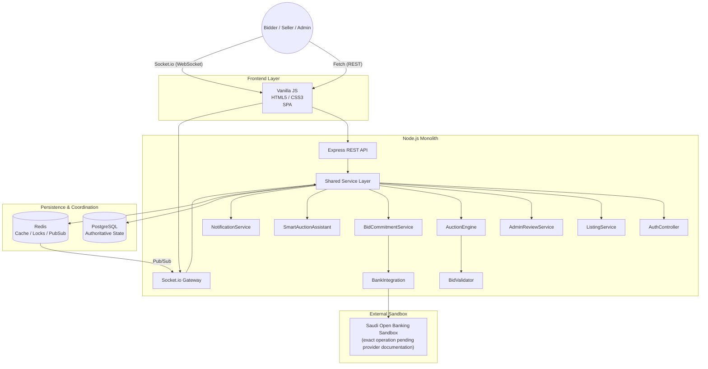
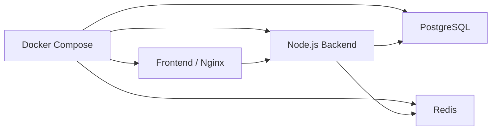
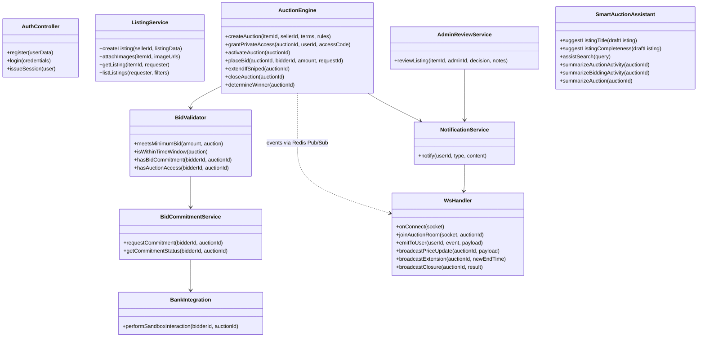
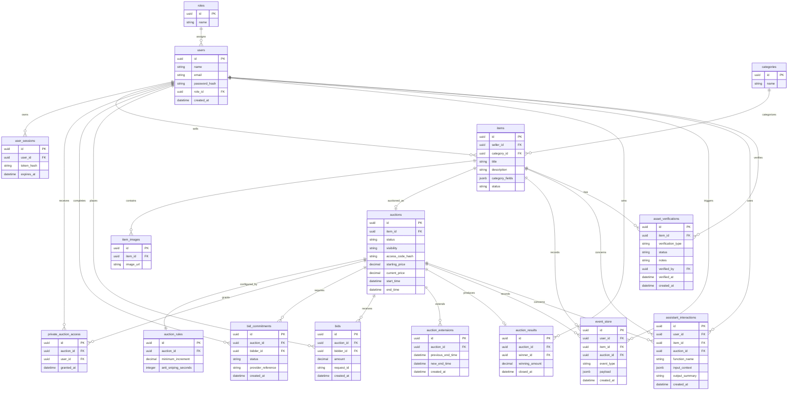
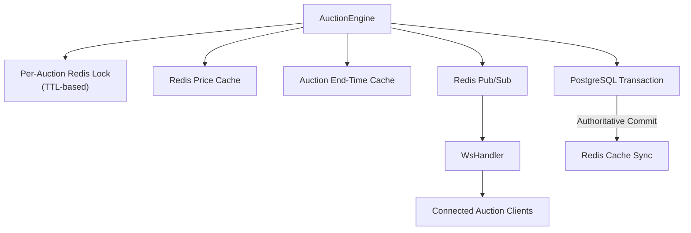
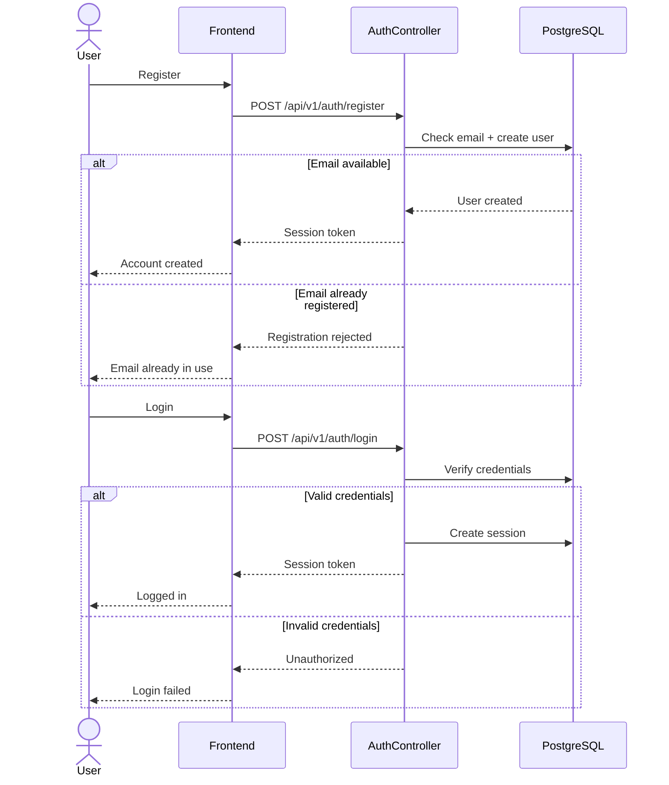
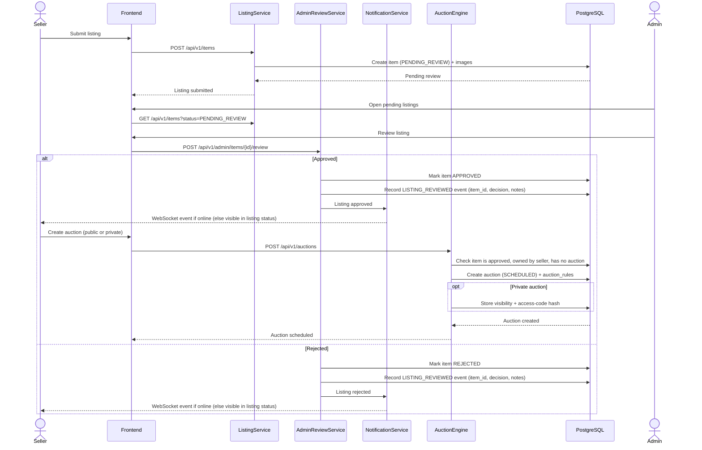
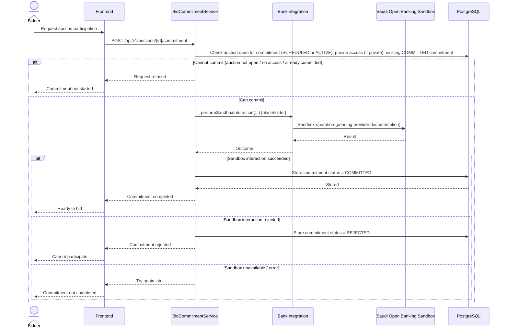
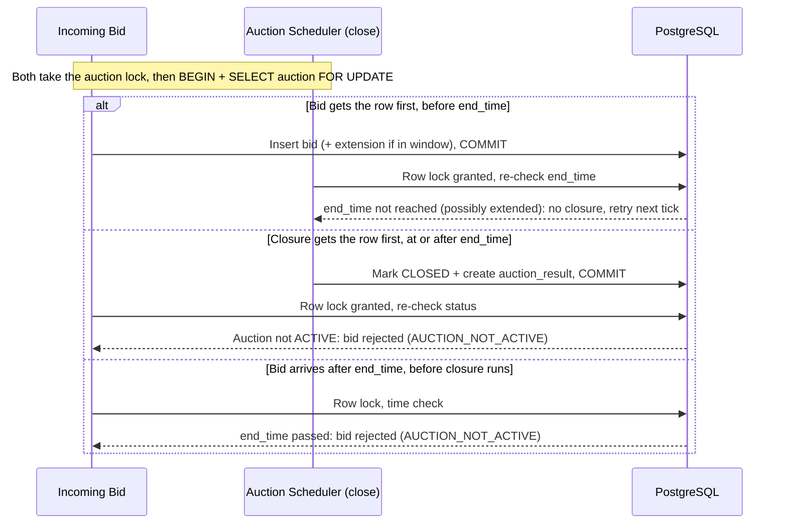

# Mezyad — Stage 3 Technical Documentation

**A High-Value Asset Auction Platform**
Graduation Capstone Project

---

## 1. Preface

Mezyad is a high-value asset auction platform designed around one core problem: building trust between strangers during a financially significant online auction.

The platform covers a controlled auction flow from seller listing and structured asset information to administrator review, public or private auctions, Bid Commitment, real-time bidding, anti-sniping, auction closure, and winner determination. It is a focused student MVP, not a production financial platform.

**Approved workflow (Stage 2):**

Registration / Login → Seller Creates Listing → Structured Asset Information → Admin Review & Approval → Public or Private Auction → Bid Commitment → Saudi Open Banking Sandbox Interaction → Live Real-Time Bidding → Anti-Sniping → Auction Closure → Winner Determination / Auction Result

The Saudi Open Banking Sandbox interaction is a supporting step inside Bid Commitment, not a separate business stage. The workflow ends at the Auction Result; nothing after that point is part of the project.

Bid Commitment is a controlled participation checkpoint before bidding, connected to a Saudi Open Banking Sandbox interaction. It is not escrow, a deposit, custody of funds, a payment, settlement, proof of funds, or guaranteed financial eligibility. The platform does not hold, move, settle, or withdraw money.

The architecture intentionally uses a focused technology stack:

- **Node.js + Express** for the backend
- **Socket.io** for real-time auction communication
- **PostgreSQL** as the authoritative source of durable business and audit state
- **Redis** for fast coordination, caching, locks, and Pub/Sub
- **Docker + Docker Compose** for a reproducible development environment
- **Saudi Open Banking Sandbox integration** for the Bid Commitment step, with the exact API operation to be finalized after reviewing the provider documentation and obtaining the required sandbox access (see Section 7.2)

Redis coordinates and caches; it never decides whether a bidding operation is accepted. PostgreSQL remains the authoritative source of truth.

---

## 2. User Stories & Mockups

### 2.1 Prioritized User Stories (MoSCoW)

| Priority | Role | User Story |
|---|---|---|
| **Must Have** | Bidder / Seller | As a new user, I want to register as a bidder or seller so that I can access the features for my role. |
| **Must Have** | Bidder / Seller | As a registered user, I want to log in so that I can access my account and continue my auction activities. |
| **Must Have** | Bidder | As a bidder, I want to see auction prices update instantly so that I can participate without refreshing the page. |
| **Must Have** | Bidder | As a bidder, I want to complete the Bid Commitment step so that I can participate in an auction. |
| **Must Have** | Seller | As a seller, I want to create a structured listing with images so that bidders can understand the asset and it can be reviewed before going live. |
| **Must Have** | Admin | As an admin, I want to review submitted listings and approve or reject them so that only reviewed listings become available for auction. |
| **Should Have** | Seller | As a seller, I want to create a public or private auction from an approved listing so that I can choose how bidders access it. |
| **Should Have** | Seller | As a seller, I want to view the status of my listings and the activity and result of my auctions so that I can follow their progress. |
| **Should Have** | Bidder | As a bidder, I want to browse public auctions so that I can find relevant assets. |
| **Should Have** | Bidder | As a bidder, I want to access a private auction by entering the required access code so that I can participate in it. |
| **Should Have** | Bidder | As a bidder, I want to know the final auction result so that I know whether I won. |
| **Should Have** | Admin | As an admin, I want to monitor auction status where necessary so that I can intervene when needed. |
| **Should Have** | Seller / Bidder | As a seller or bidder, I want to use the Smart Auction Assistant (Section 2.3) so that I can write clearer listings or follow an auction more easily. |

Registration succeeds when valid name, email, password, and bidder or seller role are provided. Invalid information or an email already in use shows an error.

Login succeeds with a registered email and correct password. Incorrect credentials show an error and do not grant access.

### 2.2 UI Mockups & Design Approach

The frontend is implemented as a lightweight SPA using Vanilla JavaScript, HTML5, CSS3, the Fetch API, and a Socket.io client. Communication is separated by purpose:

- **Fetch API:** authentication, listings, admin review, auction creation and details, private auction access, Bid Commitment, Smart Auction Assistant requests, and other transactional operations.
- **Socket.io:** live bid submission, accepted and rejected bid events, price updates, anti-sniping extensions, auction closure, and real-time notifications.

The main UI flows are authentication, seller listing creation, admin listing review, public/private auction access, the Bid Commitment step, the live auction and bidding screen, the auction result, and the Smart Auction Assistant panels.

Stage 2 lists the starting price and the auction start and end times among the seller's inputs. In the seller flow they are entered in the auction-creation step, after the listing is approved, because the workflow places the public/private choice after Admin Review & Approval. A private auction's link and its access code are shared by the seller with participants outside the platform.

### 2.3 Smart Auction Assistant

The Smart Auction Assistant is a lightweight helper that works only on information already available in the platform (listings, auctions, and recorded bids). It has exactly six functions. Each is deterministic and rule-based, computed from PostgreSQL data or from the draft the seller is entering; it uses no predictive analytics, no specially trained model, no recommendation engine, and no external AI service.

| Side | Function | Purpose |
|---|---|---|
| Seller | Listing Title Suggestion | Suggests a clear auction title from the asset information the seller entered |
| Seller | Listing Completeness Suggestions | Points out missing or incomplete listing information, including missing images |
| Bidder | Search Assistance | Helps bidders find relevant **public** auctions from simple queries on asset type, category, location, or price range |
| Bidder | Auction Activity Summary | Summarizes auction activity: number of bidders, number of bids, overall bidding activity |
| Bidder | Bidding Activity Insights | Shows basic activity patterns from recorded bid timestamps, such as bids per period |
| Bidder | Auction Summary | Overview of the auction: current highest bid, number of bids, remaining time, recent activity, and the result once closed |

The assistant never changes platform data. It does not predict prices, value assets, predict winners, recommend bids, bid autonomously, make financial decisions, approve listings, or replace the administrator. It is not a chatbot. Private auctions are not discoverable through Search Assistance.

---

## 3. System Architecture

Mezyad uses a Node.js monolithic architecture where REST and WebSocket requests enter through separate gateways but share the same service layer.


```mermaid
flowchart TD
    User((Bidder / Seller / Admin))
    subgraph Frontend["Frontend Layer"]
        UI["Vanilla JS<br/>HTML5 / CSS3<br/>SPA"]
    end
    User -->|"Fetch (REST)"| UI
    User -->|"Socket.io (WebSocket)"| UI
    subgraph Backend["Node.js Monolith"]
        Express["Express REST API"]
        WS["Socket.io Gateway"]
        Services["Shared Service Layer"]
        Auth["AuthController"]
        Listing["ListingService"]
        AdminReview["AdminReviewService"]
        Auction["AuctionEngine"]
        Validator["BidValidator"]
        Commitment["BidCommitmentService"]
        BankInt["BankIntegration"]
        Assistant["SmartAuctionAssistant"]
        Notification["NotificationService"]
        Express --> Services
        WS --> Services
        Services --> Auth
        Services --> Listing
        Services --> AdminReview
        Services --> Auction
        Services --> Commitment
        Services --> Assistant
        Services --> Notification
        Auction --> Validator
        Commitment --> BankInt
    end
    UI --> Express
    UI --> WS
    subgraph External["External Sandbox"]
        Bank["Saudi Open Banking Sandbox<br/>(exact operation pending provider documentation)"]
    end
    BankInt --> Bank
    subgraph Data["Persistence & Coordination"]
        PG[("PostgreSQL<br/>Authoritative State")]
        Redis[("Redis<br/>Cache / Locks / PubSub")]
    end
    Services --> PG
    Services --> Redis
    Redis -->|"Pub/Sub"| WS
```

All bank communication goes through `BankIntegration`, so provider-specific details stay inside one component and the frontend never contacts the bank. The sandbox candidates and the current integration status are described in Section 7.2.

### 3.1 Containerization & Environment Consistency

Mezyad is containerized using Docker and Docker Compose. The development environment consists of the Node.js backend, PostgreSQL, Redis, and the frontend service (static files served by Nginx), each in its own container.


```mermaid
flowchart LR
    Compose["Docker Compose"]
    Compose --> Backend["Node.js Backend"]
    Compose --> PG["PostgreSQL"]
    Compose --> Redis["Redis"]
    Compose --> Frontend["Frontend / Nginx"]
    Backend --> PG
    Backend --> Redis
    Frontend --> Backend
```

Docker Compose provides a reproducible environment across team members' machines and avoids dependency differences between local setups. Seeded test data (roles, categories, an administrator account, sample users) keeps testing and demonstration repeatable.

---

## 4. Backend Components & Class Design

The backend follows a service-oriented structure inside the Node.js monolith.

### 4.1 Core Classes

| Component | Responsibility |
|---|---|
| `AuthController` | Registration (bidder or seller; the administrator account is seeded), login, and session issuance. Sessions use an opaque random token; only its hash is stored in `user_sessions`. The same token authenticates REST requests and the WebSocket handshake. |
| `ListingService` | Seller listing creation, structured asset information (category-specific fields), and images; listing retrieval and listing lists |
| `AdminReviewService` | Administrator listing review, approval, and rejection |
| `AuctionEngine` | Auction creation and lifecycle (`SCHEDULED` → `ACTIVE` → `CLOSED`), private access, bidding, closing, winner determination, and anti-sniping. A timer inside the backend process (the Auction Scheduler) calls its activation and closing methods; it is not a separate service or queue. |
| `BidValidator` | Bid validation rules (Section 5.3) |
| `BidCommitmentService` | Bid Commitment flow and commitment status |
| `BankIntegration` | Communication with the Saudi Open Banking Sandbox (provider-specific details stay here) |
| `WsHandler` | WebSocket authentication, auction rooms, per-user delivery, and real-time events |
| `NotificationService` | Simple transient in-app notifications (real-time WebSocket events, not a persistent notification system) for the listing review outcome and the auction result. They are sent as WebSocket events through `WsHandler` when the user is online. There is no offline queue, message broker, push infrastructure, or stored notification; otherwise the outcome is visible from the listing status or auction result on the next page load. |
| `SmartAuctionAssistant` | The six read-only assistant functions defined in Section 2.3 |

### 4.2 Class Diagram


```mermaid
classDiagram
    class AuthController {
        +register(userData)
        +login(credentials)
        +issueSession(user)
    }
    class ListingService {
        +createListing(sellerId, listingData)
        +attachImages(itemId, imageUrls)
        +getListing(itemId, requester)
        +listListings(requester, filters)
    }
    class AdminReviewService {
        +reviewListing(itemId, adminId, decision, notes)
    }
    class AuctionEngine {
        +createAuction(itemId, sellerId, terms, rules)
        +grantPrivateAccess(auctionId, userId, accessCode)
        +activateAuction(auctionId)
        +placeBid(auctionId, bidderId, amount, requestId)
        +extendIfSniped(auctionId)
        +closeAuction(auctionId)
        +determineWinner(auctionId)
    }
    class BidValidator {
        +meetsMinimumBid(amount, auction)
        +isWithinTimeWindow(auction)
        +hasBidCommitment(bidderId, auctionId)
        +hasAuctionAccess(bidderId, auctionId)
    }
    class BidCommitmentService {
        +requestCommitment(bidderId, auctionId)
        +getCommitmentStatus(bidderId, auctionId)
    }
    class BankIntegration {
        +performSandboxInteraction(bidderId, auctionId)
    }
    class WsHandler {
        +onConnect(socket)
        +joinAuctionRoom(socket, auctionId)
        +emitToUser(userId, event, payload)
        +broadcastPriceUpdate(auctionId, payload)
        +broadcastExtension(auctionId, newEndTime)
        +broadcastClosure(auctionId, result)
    }
    class NotificationService {
        +notify(userId, type, content)
    }
    class SmartAuctionAssistant {
        +suggestListingTitle(draftListing)
        +suggestListingCompleteness(draftListing)
        +assistSearch(query)
        +summarizeAuctionActivity(auctionId)
        +summarizeBiddingActivity(auctionId)
        +summarizeAuction(auctionId)
    }
    AuctionEngine --> BidValidator
    AuctionEngine ..> WsHandler : events via Redis Pub/Sub
    AuctionEngine --> NotificationService
    BidValidator --> BidCommitmentService
    BidCommitmentService --> BankIntegration
    AdminReviewService --> NotificationService
    NotificationService --> WsHandler
```

> Note: `BankIntegration.performSandboxInteraction` is a **provider-dependent placeholder**. Its parameters, the sandbox operation behind it, and its result are not defined until the provider documentation is reviewed and sandbox access is granted. It is expected to return only an outcome the service can map to `COMMITTED`, `REJECTED`, or "unavailable".

---

## 5. Database Design & Redis Coordination

PostgreSQL is the authoritative, durable source of truth for users, roles, sessions, listings, auction state, private access, commitments, bids, auction extensions, results, and audit records. Redis is a real-time coordination layer — locks, caching, and Pub/Sub. It never decides whether a bid is accepted; that decision is made once, inside a PostgreSQL transaction. PostgreSQL is the authoritative source of truth for all persistent business state. Redis is used only for temporary coordination, caching, per-auction locking, and Pub/Sub, and its values can always be rebuilt or recovered from PostgreSQL.

### 5.1 PostgreSQL ER Diagram

The schema has **16 PostgreSQL tables**, grouped in Section 5.2. The diagram below is the MVP schema design. The schema defines the current MVP data model. The `provider_reference` field of `bid_commitments` remains provider-dependent because its value depends on the selected sandbox operation. Exact migration syntax and implementation details will be finalized during implementation.


```mermaid
erDiagram
    users {
        uuid id PK
        string name
        string email
        string password_hash
        uuid role_id FK
        datetime created_at
    }
    roles {
        uuid id PK
        string name
    }
    user_sessions {
        uuid id PK
        uuid user_id FK
        string token_hash
        datetime expires_at
    }
    categories {
        uuid id PK
        string name
    }
    items {
        uuid id PK
        uuid seller_id FK
        uuid category_id FK
        string title
        string description
        jsonb category_fields
        string status
    }
    item_images {
        uuid id PK
        uuid item_id FK
        string image_url
    }
    auctions {
        uuid id PK
        uuid item_id FK
        string status
        string visibility
        string access_code_hash
        decimal starting_price
        decimal current_price
        datetime start_time
        datetime end_time
    }
    auction_rules {
        uuid id PK
        uuid auction_id FK
        decimal minimum_increment
        integer anti_sniping_seconds
    }
    private_auction_access {
        uuid id PK
        uuid auction_id FK
        uuid user_id FK
        datetime granted_at
    }
    bid_commitments {
        uuid id PK
        uuid auction_id FK
        uuid bidder_id FK
        string status
        string provider_reference
        datetime created_at
    }
    bids {
        uuid id PK
        uuid auction_id FK
        uuid bidder_id FK
        decimal amount
        string request_id
        datetime created_at
    }
    auction_extensions {
        uuid id PK
        uuid auction_id FK
        datetime previous_end_time
        datetime new_end_time
        datetime created_at
    }
    auction_results {
        uuid id PK
        uuid auction_id FK
        uuid winner_id FK
        decimal winning_amount
        datetime closed_at
    }
    event_store {
        uuid id PK
        uuid user_id FK
        uuid item_id FK
        uuid auction_id FK
        string event_type
        jsonb payload
        datetime created_at
    }
    assistant_interactions {
        uuid id PK
        uuid user_id FK
        uuid item_id FK
        uuid auction_id FK
        string function_name
        jsonb input_context
        string output_summary
        datetime created_at
    }
    asset_verifications {
        uuid id PK
        uuid item_id FK
        string verification_type
        string status
        string notes
        uuid verified_by FK
        datetime verified_at
        datetime created_at
    }

    roles ||--o{ users : assigns
    users ||--o{ user_sessions : owns
    users ||--o{ items : sells
    categories ||--o{ items : categorizes
    items ||--o{ item_images : contains
    items ||--o| auctions : auctioned_as
    auctions ||--|| auction_rules : configured_by
    auctions ||--o{ private_auction_access : grants
    users ||--o{ private_auction_access : receives
    auctions ||--o{ bid_commitments : requires
    users ||--o{ bid_commitments : completes
    auctions ||--o{ bids : receives
    users ||--o{ bids : places
    auctions ||--o{ auction_extensions : extends
    auctions ||--o| auction_results : produces
    users ||--o{ auction_results : wins
    users ||--o{ event_store : triggers
    items ||--o{ event_store : records
    auctions ||--o{ event_store : records
    users ||--o{ assistant_interactions : uses
    items ||--o{ assistant_interactions : concerns
    auctions ||--o{ assistant_interactions : concerns
    items ||--o{ asset_verifications : has
    users ||--o{ asset_verifications : verifies
```

**Constraints.**

| Table | Constraint | Purpose |
|---|---|---|
| `users` | `UNIQUE (email)` | One account per email (`409` on registration) |
| `roles`, `categories` | `UNIQUE (name)` | Seeded values only: roles `BIDDER`, `SELLER`, `ADMIN`; categories `vehicles`, `real_estate` |
| `user_sessions` | `UNIQUE (token_hash)` | Session lookup |
| `auctions` | `UNIQUE (item_id)` | An approved item has at most one auction |
| `auctions` | `CHECK (end_time > start_time)`, `CHECK (starting_price > 0)`, `CHECK (visibility IN ('PUBLIC','PRIVATE'))`, `CHECK (visibility = 'PUBLIC' OR access_code_hash IS NOT NULL)` | Valid terms; private auctions always have a code hash |
| `auction_rules` | `UNIQUE (auction_id)`, `CHECK (minimum_increment > 0)`, `CHECK (anti_sniping_seconds > 0)` | One rule set per auction |
| `private_auction_access` | `UNIQUE (auction_id, user_id)` | One grant per bidder and auction |
| `bid_commitments` | `UNIQUE (auction_id, bidder_id)` | One commitment row per bidder and auction |
| `bids` | `UNIQUE (auction_id, request_id)`, `request_id NOT NULL`, `CHECK (amount > 0)` | Idempotency (Section 7.1) |
| `auction_results` | `UNIQUE (auction_id)` | Prevents a duplicate result. Application logic (the closing transaction) guarantees that every successful closure creates exactly one result |
| `assistant_interactions` | `CHECK (function_name IN ('LISTING_TITLE_SUGGESTION','LISTING_COMPLETENESS_SUGGESTIONS','SEARCH_ASSISTANCE','AUCTION_ACTIVITY_SUMMARY','BIDDING_ACTIVITY_INSIGHTS','AUCTION_SUMMARY'))` | Only the six assistant functions can be logged |
| `asset_verifications` | `UNIQUE (item_id, verification_type)`, `CHECK (status IN ('PENDING','VERIFIED','REJECTED'))` | One record per verification type per item |
| all additional tables | Foreign keys to `users`, `items`, or `auctions`; `created_at` defaults to the current time | Referential integrity |

**Nullable fields:**

| Field | Nullable when |
|---|---|
| `auctions.access_code_hash` | The auction is public |
| `auction_results.winner_id` and `winning_amount` | The auction closed with no accepted bid |
| `bid_commitments.provider_reference` | The sandbox interaction returned no reference (provisional) |
| `event_store.item_id`, `auction_id`, `user_id` | The event does not concern that entity (a listing review has no auction; a system closure event has no user) |
| `assistant_interactions.item_id`, `auction_id` | The interaction does not concern that entity (seller functions work on a draft; Search Assistance has no single auction) |
| `asset_verifications.verified_by`, `verified_at`, `notes` | The verification is still `PENDING` (or no notes were given) |

**Status values:**

| Table | Values |
|---|---|
| `items.status` | `PENDING_REVIEW`, `APPROVED`, `REJECTED` |
| `auctions.status` | `SCHEDULED`, `ACTIVE`, `CLOSED` |
| `bid_commitments.status` | `COMMITTED`, `REJECTED` |
| `asset_verifications.status` | `PENDING`, `VERIFIED`, `REJECTED` |

**Money and time.** Monetary values are stored as PostgreSQL `NUMERIC(18,2)`, and authoritative price comparisons use those values, not binary floating-point arithmetic. All persisted timestamps and auction time comparisons use UTC; clients convert to local time for display only.

**Listings.** `items.category_fields` holds the category-specific structured information as JSON: vehicles use `make`, `model`, `year`, `mileage`, `condition`; real estate uses `propertyType`, `area`, `location`, `bedrooms`, `condition`. It is the single source of asset specifications, including the location used by Search Assistance where a category defines one (real estate). Images are stored as URLs in `item_images`; the MVP has no file-upload or storage service.

**Auction lifecycle.** An auction is created as `SCHEDULED` with `current_price = starting_price`. The Auction Scheduler activates it at `start_time` and closes it at `end_time` (Flow 5).

**Admin review and audit.** `items.status` holds the current review state. `event_store` is a simple append-only audit log; it is not event sourcing and no application state is rebuilt from it. The MVP records two event types: `LISTING_REVIEWED` (decision and notes, linked to the item) and `AUCTION_CLOSED` (linked to the auction, no user).

**Private auctions.** A private auction has `visibility = PRIVATE` and stores only a hash of its access code (`access_code_hash`); the plaintext code is never stored. When a bidder submits the code, the server compares it with the stored hash and, if it matches, records the grant in `private_auction_access`. That record is what later protected operations check (auction details, Bid Commitment, joining the auction room, `bid:place`), so the bidder does not send the code again. There is no invitation system. Private auctions do not appear in the public auction list.

**Auction result rule.** Every closed auction gets exactly one `auction_results` row. If the auction closed with no accepted bid, the row is still created, with `winner_id` and `winning_amount` empty. `UNIQUE (auction_id)` prevents duplicate results, while the closing transaction guarantees that every successful closure creates exactly one. The API response and the WebSocket closure event follow the same rule. Because every accepted bid must exceed the previous price, the highest accepted bid is unique and there are no ties.

**Additional supporting tables.** These two tables add only supporting data. None is a payment, escrow, KYC, identity, ownership, appraisal, or AI structure, none touches the Bid Commitment or Saudi Open Banking Sandbox boundary, and none is read by the bid-acceptance path. Each is a leaf table: it references `users`, `items`, or `auctions`, and no other table references it, so the schema has no circular dependencies.

- **`assistant_interactions`** is a simple usage log written by `SmartAuctionAssistant`: which of the six functions was called, by whom, its input parameters (for example the search query) as `input_context`, and a short `output_summary`. It is not a model, training data, or a recommendation store, and the assistant still changes no listing, auction, or bid data.
- **`asset_verifications`** records the state of the administrator's review of a listing's information (`verification_type = 'LISTING_INFORMATION'`, the only type in the MVP): `PENDING` on submission, then `VERIFIED` or `REJECTED` with the administrator in `verified_by`. It is not KYC, identity verification, or ownership verification, and no external system is involved. `items.status` stays the authoritative review state that gates auction creation.

**Relationship review.** New relationships: users 1:N `assistant_interactions`; items 1:N `assistant_interactions` and auctions 1:N `assistant_interactions` (both optional on the log row); items 1:0..N `asset_verifications` (with `verified_by` referencing `users`). All original relationships are unchanged. Overlaps to keep in mind: `items.status`, `asset_verifications`, and `event_store` (`LISTING_REVIEWED`) all relate to a review, each with a distinct role: `items.status` is the current state that gates auction creation, `asset_verifications` is the structured verification record, and `event_store` is the append-only audit entry with the decision notes. `items.status` stays the authoritative review state.

### 5.2 Database Tables

The schema has 16 tables. The grouping is logical only; it does not change the architecture or the workflow.

| Group | Table | Purpose | Status |
|---|---|---|---|
| Identity & Access | `users` | User accounts | Used |
| Identity & Access | `roles` | Role definitions for access control (bidder, seller, administrator) | Used |
| Identity & Access | `user_sessions` | Active login sessions | Used |
| Asset & Listing | `categories` | Asset categories (vehicles, real estate) | Used |
| Asset & Listing | `items` | Listed assets, including structured category fields and the current review status | Used |
| Asset & Listing | `item_images` | Images attached to a listing | Used |
| Asset & Listing | `asset_verifications` | State of the administrator's review of a listing's information (not KYC) | Used by `AdminReviewService` |
| Auction | `auctions` | Auction records, including visibility and the access-code hash for private auctions | Used |
| Auction | `auction_rules` | Per-auction configuration (minimum increment, anti-sniping window) | Used |
| Auction | `private_auction_access` | Bidders who have entered a valid access code for a private auction | Used |
| Bidding & Results | `bid_commitments` | Bid Commitment status per bidder and auction, linked to the sandbox interaction result | Used |
| Bidding & Results | `bids` | Accepted bids only | Used |
| Bidding & Results | `auction_extensions` | Log of anti-sniping time extensions | Used |
| Bidding & Results | `auction_results` | Final outcome of every closed auction (winner fields empty when there is no winner) | Used |
| Assistant & Audit | `assistant_interactions` | Simple usage log of the six Smart Auction Assistant functions | Used by `SmartAuctionAssistant` |
| Assistant & Audit | `event_store` | Simple append-only audit log (listing review decisions and notes, auction closure) | Used |

### 5.3 Redis Design

Redis coordinates and caches; PostgreSQL decides and persists.


```mermaid
flowchart TD
    AuctionEngine["AuctionEngine"]
    AuctionEngine --> Lock["Per-Auction Redis Lock<br/>(TTL-based)"]
    AuctionEngine --> Price["Redis Price Cache"]
    AuctionEngine --> End["Auction End-Time Cache"]
    AuctionEngine --> PubSub["Redis Pub/Sub"]
    PubSub --> WsHandler["WsHandler"]
    WsHandler --> Clients["Connected Auction Clients"]
    AuctionEngine --> PG["PostgreSQL Transaction"]
    PG -->|"Authoritative Commit"| RedisSync["Redis Cache Sync"]
```

**Redis key schema:**

| Key Pattern | Type | Purpose |
|---|---|---|
| `auction:{id}:price` | String | Cached current highest accepted bid |
| `auction:{id}:lock` | String (TTL) | Per-auction lock |
| `auction:{id}:end_time` | String | Cached auction end time |
| `auction:{id}:events` | Pub/Sub channel | Auction event broadcast |

**Bid validation rules.** A bid is accepted only if all of these hold:
1. The requester is authenticated with the `BIDDER` role.
2. The auction has private access for the bidder, if it is private (`private_auction_access`).
3. The bidder has a `COMMITTED` Bid Commitment for the auction.
4. The auction is `ACTIVE` and PostgreSQL's current time is before `end_time`.
5. The amount is at least `starting_price` for the first bid, and otherwise at least `current_price + minimum_increment`.

Rules 2 and 3 are read by `BidValidator` before the transaction; rules 4 and 5 are decided again inside the transaction, from authoritative state.

**Bid critical path:**


```mermaid
flowchart LR
    Bid["Bid Arrives"]
    ReqId["requestId check"]
    Lock["Acquire Auction Lock"]
    Cache["Preliminary Redis Check"]
    Validate["BidValidator"]
    PG["PostgreSQL Transaction<br/>(row lock + authoritative re-check)"]
    Commit["Commit"]
    Update["Update Redis"]
    Publish["Pub/Sub"]
    Broadcast["WebSocket Broadcast"]
    Release["Release Lock"]
    Bid --> ReqId
    ReqId --> Lock
    Lock --> Cache
    Cache --> Validate
    Validate --> PG
    PG --> Commit
    Commit --> Update
    Update --> Publish
    Publish --> Broadcast
    Broadcast --> Release
```

**How concurrency is handled:**

- **The lock coordinates.** The per-auction lock serializes concurrent bids and the Auction Scheduler's closing for the same auction, which reduces contention before requests reach the database. The MVP uses a single Redis instance with a short-TTL per-auction lock; nothing depends on it for correctness. The lock is released in a `finally` block after every bid or closure attempt, whether it succeeds or fails, so an exception never holds it until the TTL expires.
- **PostgreSQL decides.** Inside the transaction the auction row is read with `SELECT … FOR UPDATE`, which serializes every bid and every closure on that auction in the database itself. Status, `end_time`, and `current_price` are re-checked from that row, using PostgreSQL's clock for time comparisons. If the Redis lock expires early or is lost, the row lock and re-check still reject any bid that is no longer valid, so lock expiry cannot produce an inconsistent acceptance.
- **Time authority.** PostgreSQL's clock is the only clock used for auction start, end, anti-sniping, and closure decisions. Frontend countdowns are presentation only; neither the browser clock, Redis, nor the Node.js process clock decides anything.
- **Redis values are derived state.** The cached price and end time are used only for a fast preliminary check. A stale cached value can at worst cause a valid bid to be rejected early or an invalid bid to reach the transaction, where it is rejected; it can never cause an invalid bid to be accepted. The scheduler and the transaction never read `end_time` from Redis.
- **Redis failure does not make Redis authoritative.** If the lock cannot be obtained (including when Redis is unreachable), the bid is not processed and the client is told so; PostgreSQL state is unaffected. If the cache is unavailable or stale after a commit, it is rebuilt from PostgreSQL before the next bid is evaluated.
- **Pub/Sub is best-effort.** Redis Pub/Sub delivers real-time events on a best-effort basis; it is not a durable event store. REST retrieval from PostgreSQL provides authoritative state recovery. Auction-wide real-time events use Redis Pub/Sub, while user-specific notifications are delivered directly through `WsHandler`; `NotificationService` does not persist notifications.
- **Rollback prevents false publication.** A bid event is published only after the PostgreSQL commit. If the transaction fails, it rolls back and no accepted bid is ever published. If a published event is missed by a client, the client recovers the true state through `GET /api/v1/auctions/{id}`.

---

## 6. Sequence Diagrams

Mezyad is documented through five core end-to-end flows covering registration and login, listing review and auction creation, Bid Commitment, live bidding with anti-sniping, and auction closure, plus the supporting close-vs-bid race.

### Flow 1 — Registration & Login


```mermaid
sequenceDiagram
    actor User
    participant UI as Frontend
    participant Auth as AuthController
    participant DB as PostgreSQL
    User->>UI: Register
    UI->>Auth: POST /api/v1/auth/register
    Auth->>DB: Check email + create user
    alt Email available
        DB-->>Auth: User created
        Auth-->>UI: Session token
        UI-->>User: Account created
    else Email already registered
        Auth-->>UI: Registration rejected
        UI-->>User: Email already in use
    end
    User->>UI: Login
    UI->>Auth: POST /api/v1/auth/login
    Auth->>DB: Verify credentials
    alt Valid credentials
        Auth->>DB: Create session
        Auth-->>UI: Session token
        UI-->>User: Logged in
    else Invalid credentials
        Auth-->>UI: Unauthorized
        UI-->>User: Login failed
    end
```

### Flow 2 — Listing Submission, Admin Review & Auction Creation


```mermaid
sequenceDiagram
    actor Seller
    participant UI as Frontend
    participant Listing as ListingService
    participant Review as AdminReviewService
    participant Notify as NotificationService
    participant Engine as AuctionEngine
    participant DB as PostgreSQL
    actor Admin
    Seller->>UI: Submit listing
    UI->>Listing: POST /api/v1/items
    Listing->>DB: Create item (PENDING_REVIEW) + images
    DB-->>Listing: Pending review
    Listing-->>UI: Listing submitted
    Admin->>UI: Open pending listings
    UI->>Listing: GET /api/v1/items?status=PENDING_REVIEW
    Admin->>UI: Review listing
    UI->>Review: POST /api/v1/admin/items/{id}/review
    alt Approved
        Review->>DB: Mark item APPROVED
        Review->>DB: Record LISTING_REVIEWED event (item_id, decision, notes)
        Review->>Notify: Listing approved
        Notify-->>Seller: WebSocket event if online (else visible in listing status)
        Seller->>UI: Create auction (public or private)
        UI->>Engine: POST /api/v1/auctions
        Engine->>DB: Check item is approved, owned by seller, has no auction
        Engine->>DB: Create auction (SCHEDULED) + auction_rules
        opt Private auction
            Engine->>DB: Store visibility + access-code hash
        end
        DB-->>Engine: Auction created
        Engine-->>UI: Auction scheduled
    else Rejected
        Review->>DB: Mark item REJECTED
        Review->>DB: Record LISTING_REVIEWED event (item_id, decision, notes)
        Review->>Notify: Listing rejected
        Notify-->>Seller: WebSocket event if online (else visible in listing status)
    end
```

### Flow 3 — Bid Commitment & Saudi Open Banking Sandbox


```mermaid
sequenceDiagram
    actor Bidder
    participant UI as Frontend
    participant Commit as BidCommitmentService
    participant BankInt as BankIntegration
    participant Bank as Saudi Open Banking Sandbox
    participant DB as PostgreSQL
    Bidder->>UI: Request auction participation
    UI->>Commit: POST /api/v1/auctions/{id}/commitment
    Commit->>DB: Check auction open for commitment (SCHEDULED or ACTIVE), private access (if private), existing COMMITTED commitment
    alt Cannot commit (auction not open / no access / already committed)
        Commit-->>UI: Request refused
        UI-->>Bidder: Commitment not started
    else Can commit
        Commit->>BankInt: performSandboxInteraction(...) [placeholder]
        BankInt->>Bank: Sandbox operation (pending provider documentation)
        Bank-->>BankInt: Result
        BankInt-->>Commit: Outcome
        alt Sandbox interaction succeeded
            Commit->>DB: Store commitment status = COMMITTED
            DB-->>Commit: Stored
            Commit-->>UI: Commitment completed
            UI-->>Bidder: Ready to bid
        else Sandbox interaction rejected
            Commit->>DB: Store commitment status = REJECTED
            Commit-->>UI: Commitment rejected
            UI-->>Bidder: Cannot participate
        else Sandbox unavailable / error
            Commit-->>UI: Try again later
            UI-->>Bidder: Commitment not completed
        end
    end
```

> Note: the specific sandbox operation and its response are provisional. They depend on the provider documentation and the sandbox access actually granted. No endpoint, permission, or result shown here is confirmed. A rejected commitment can be retried by updating the existing commitment row; a second row is never created for the same bidder and auction. Nothing is stored when the sandbox is unavailable.

### Flow 4 — Real-Time Bidding & Anti-Sniping ⭐

```mermaid
sequenceDiagram
    actor Bidder
    participant UI as Frontend
    participant WS as WsHandler
    participant Engine as AuctionEngine
    participant Redis as Redis
    participant Lock as Auction Lock
    participant Validator as BidValidator
    participant DB as PostgreSQL
    participant PubSub as Redis Pub/Sub
    actor Others as Other Bidders

    Bidder->>UI: Place bid
    UI->>WS: bid:place (auctionId, amount, requestId)
    WS->>Engine: placeBid (authenticated bidder)
    Engine->>DB: Look up bid by (auction_id, requestId)
    alt Duplicate requestId (bid already stored)
        Engine-->>WS: Original accepted result
        WS-->>UI: bid:accepted (original)
    else New request
        Engine->>Lock: Acquire auction lock
        alt Lock acquired
            Engine->>Redis: Read cached price / end_time (preliminary check only)
            Redis-->>Engine: Cached values
            Engine->>Validator: Validate (role, private access, commitment, minimum bid)
            Validator->>DB: Read access and commitment
            DB-->>Validator: Current state
            Validator-->>Engine: Validation result
            alt Validation passed
                Engine->>DB: BEGIN transaction
                Engine->>DB: SELECT auction FOR UPDATE (status, end_time, current_price, DB time)
                alt Still valid (ACTIVE, before end_time, amount high enough)
                    Engine->>DB: Insert bid (UNIQUE auction_id + request_id)
                    Engine->>DB: Update auction current_price
                    opt Bid within anti_sniping_seconds of end_time
                        Engine->>DB: Extend end_time + insert auction_extensions row
                    end
                    DB-->>Engine: COMMIT
                    Engine->>Redis: Update price / end_time cache
                    opt Redis update fails
                        Note over Engine,Redis: PostgreSQL stays authoritative;<br/>cache is rebuilt from PostgreSQL before the next bid
                    end
                    Engine->>PubSub: Publish bid event (+ extension if any)
                    PubSub-->>WS: Event
                    WS-->>Others: bid:accepted (+ auction:extended if applicable)
                    WS-->>Bidder: bid:accepted
                else No longer valid
                    Engine->>DB: ROLLBACK
                    Engine-->>WS: Bid rejected
                    WS-->>Bidder: bid:rejected
                end
            else Validation failed
                Engine-->>WS: Bid rejected
                WS-->>Bidder: bid:rejected
            end
            Engine->>Lock: Release
        else Lock unavailable
            Engine-->>WS: Bid not processed
            WS-->>Bidder: bid:rejected (BID_NOT_PROCESSED)
        end
    end
```

**Anti-sniping rule (MVP).** A bid accepted when `end_time` minus PostgreSQL's current time is at most `anti_sniping_seconds` extends `end_time` by `anti_sniping_seconds`. The new `end_time`, the `auctions` price update, the bid, and the `auction_extensions` row are written in the same transaction, so they commit together or not at all. Each qualifying bid can extend the auction again. The extension is broadcast as `auction:extended`, and the Redis end-time cache is updated only after the commit.

**Duplicate handling.** Only accepted bids are stored, so a repeated `requestId` of an accepted bid returns the original result. The lookup above is a fast path; `UNIQUE (auction_id, request_id)` is the guarantee. If two identical requests race, the database refuses the second insert and the engine returns the stored result. The engine explicitly compares the authenticated bidder with the bidder stored on the existing bid; a request whose `requestId` belongs to a different bidder is rejected and never receives that bid's result. This check does not rely on the unique constraint alone.

**Close-vs-bid race.** Both bids and closure take the same per-auction lock and, inside their transaction, the same `SELECT … FOR UPDATE` on the auction row, so the database serializes them even if the lock fails. A bid is valid only while the auction is `ACTIVE` and PostgreSQL's time is before `end_time`; closure is valid only when the auction is `ACTIVE` and PostgreSQL's time is at or after `end_time`.


```mermaid
sequenceDiagram
    participant Bid as Incoming Bid
    participant Close as Auction Scheduler (close)
    participant DB as PostgreSQL
    Note over Bid,Close: Both take the auction lock, then BEGIN + SELECT auction FOR UPDATE
    alt Bid gets the row first, before end_time
        Bid->>DB: Insert bid (+ extension if in window), COMMIT
        Close->>DB: Row lock granted, re-check end_time
        DB-->>Close: end_time not reached (possibly extended): no closure, retry next tick
    else Closure gets the row first, at or after end_time
        Close->>DB: Mark CLOSED + create auction_result, COMMIT
        Bid->>DB: Row lock granted, re-check status
        DB-->>Bid: Auction not ACTIVE: bid rejected (AUCTION_NOT_ACTIVE)
    else Bid arrives after end_time, before closure runs
        Bid->>DB: Row lock, time check
        DB-->>Bid: end_time passed: bid rejected (AUCTION_NOT_ACTIVE)
    end
```

### Flow 5 — Auction Closure & Winner Determination

```mermaid
sequenceDiagram
    participant Scheduler as Auction Scheduler
    participant Lock as Auction Lock
    participant Engine as AuctionEngine
    participant DB as PostgreSQL
    participant PubSub as Redis Pub/Sub
    participant WS as WsHandler
    participant Notify as NotificationService
    actor Bidders as Connected Bidders
    Scheduler->>DB: Find ACTIVE auctions whose end_time has passed
    Scheduler->>Lock: Acquire auction lock
    Lock-->>Scheduler: Lock acquired (else retry next tick)
    Scheduler->>Engine: closeAuction
    Engine->>DB: BEGIN, SELECT auction FOR UPDATE, re-check status ACTIVE and end_time reached
    Engine->>DB: Mark auction CLOSED
    Engine->>DB: Determine winner (highest accepted bid, or none)
    Engine->>DB: Create auction_result (UNIQUE auction_id; winner fields empty if no accepted bid)
    Engine->>DB: Record AUCTION_CLOSED event
    DB-->>Engine: COMMIT
    Engine->>PubSub: Publish closure event
    PubSub-->>WS: auction:closed
    WS-->>Bidders: auction:closed (result)
    Engine->>Notify: Auction result (seller, winner)
    Engine->>Lock: Release lock
```

Flow 5 covers closure only. The Auction Scheduler is a timer in the backend process that runs every few seconds and has a separate, independent path for activation (`SCHEDULED` → `ACTIVE`), which is not part of this closure flow and calls `activateAuction` with the same lock-and-transaction pattern: if the auction is `SCHEDULED` and PostgreSQL's time is at or after `start_time` it becomes `ACTIVE`; otherwise nothing changes, so repeated scheduler checks are harmless. Closure is idempotent: if the auction is no longer `ACTIVE`, nothing is created, so an auction can never receive a second result. The lifecycle ends with the stored and broadcast auction result; every closed auction has one, including an auction with no accepted bid.

---

## 7. API Specifications

### 7.1 REST vs. WebSocket

Mezyad uses REST for request/response operations and resource retrieval, and WebSocket for live auction interactions (bid submission) and server-pushed events.

All REST request and response bodies use `application/json`. Except for registration and login, REST requests require `Authorization: Bearer <accessToken>`. Monetary values in the examples are illustrative test values only; no endpoint transfers, holds, or settles money, and no bank endpoint is exposed to clients.

All REST error responses use one shape, so the frontend handles every failure the same way. `code` is a stable machine-readable string and `message` is human-readable; the HTTP status codes listed for each route below are unchanged.

```json
{
  "error": {
    "code": "VALIDATION_ERROR",
    "message": "The request contains missing or invalid fields."
  }
}
```

WebSocket rejections use the `bid:rejected` event defined below, which carries its own `code` and `message`.

| Endpoint | Method | Access | Description | Status |
|---|---|---|---|---|
| `/api/v1/auth/register` | POST | Public | Register a bidder or seller | Planned |
| `/api/v1/auth/login` | POST | Public | Authenticate user | Planned |
| `/api/v1/items` | POST | Seller | Create item listing (structured asset information, images) | Planned |
| `/api/v1/items` | GET | Seller (own listings), Admin (all; filter `?status=`) | List listings, including the admin review queue | Planned |
| `/api/v1/items/{id}` | GET | Seller (owner), Admin; others once approved | Retrieve listing details | Planned |
| `/api/v1/admin/items/{id}/review` | POST | Admin | Approve or reject a listing | Planned |
| `/api/v1/auctions` | POST | Seller (owner of an approved listing) | Create a public or private auction | Planned |
| `/api/v1/auctions` | GET | Authenticated | Browse public auctions; a seller with `?mine=true` sees own auctions; an administrator sees all auctions for monitoring | Planned |
| `/api/v1/auctions/{id}` | GET | Authenticated (private: granted access, the owning seller, or an administrator) | Retrieve auction details and result | Planned |
| `/api/v1/auctions/{id}/access` | POST | Bidder | Enter a private auction access code | Planned |
| `/api/v1/auctions/{id}/commitment` | POST | Bidder | Complete the Bid Commitment step | Planned |

> Note: no endpoint is implemented yet. "Planned" means part of the agreed contract; a route is marked implemented only after it exists and its tests have run. The request and response bodies below are illustrative.

**Smart Auction Assistant endpoints.** The six functions from Section 2.3 change no platform data. The two seller functions take the listing draft in the request body, so they help during listing creation and store nothing; the four bidder functions are `GET` operations. There is exactly one route per function.

| Function | Method and route | Access |
|---|---|---|
| Listing Title Suggestion | POST `/api/v1/assistant/listing-title-suggestion` (body: draft listing) | Seller |
| Listing Completeness Suggestions | POST `/api/v1/assistant/listing-completeness` (body: draft listing) | Seller |
| Search Assistance | GET `/api/v1/assistant/search?q={query}` | Authenticated (public auctions only) |
| Auction Activity Summary | GET `/api/v1/assistant/auctions/{id}/activity-summary` | Authenticated (private: granted access) |
| Bidding Activity Insights | GET `/api/v1/assistant/auctions/{id}/bidding-insights` | Authenticated (private: granted access) |
| Auction Summary | GET `/api/v1/assistant/auctions/{id}/summary` | Authenticated (private: granted access) |

### REST Request and Response Contracts

#### `POST /api/v1/auth/register`

Registers a bidder or seller. Administrator accounts are seeded, not registered.

**Request body**

```json
{
  "name": "Aseel Alzhrani",
  "email": "aseel@example.test",
  "password": "ExamplePassword123!",
  "role": "BIDDER"
}
```

**Success — `201 Created`**

```json
{
  "data": {
    "userId": "1f0d2fd7-4a7a-4d0e-9f73-7a1cbfce9e01",
    "email": "aseel@example.test",
    "role": "BIDDER",
    "accessToken": "example-access-token"
  }
}
```

**Errors:** `400 Bad Request` for missing or invalid fields (including a role other than `BIDDER` or `SELLER`) and `409 Conflict` when the email is already registered.

#### `POST /api/v1/auth/login`

Authenticates an existing user and creates a session.

**Request body**

```json
{
  "email": "aseel@example.test",
  "password": "ExamplePassword123!"
}
```

**Success — `200 OK`**

```json
{
  "data": {
    "accessToken": "example-access-token",
    "user": {
      "id": "1f0d2fd7-4a7a-4d0e-9f73-7a1cbfce9e01",
      "name": "Aseel Alzhrani",
      "role": "BIDDER"
    }
  }
}
```

**Errors:** `400 Bad Request` for incomplete credentials and `401 Unauthorized` for an invalid email or password.

#### `POST /api/v1/items`

Creates a seller's listing with its structured asset information in `PENDING_REVIEW` status. The listing cannot be used for an auction until an administrator approves it. Auction terms (starting price, times, visibility) are set later, when the seller creates the auction.

**Request body**

```json
{
  "title": "2020 Classic Vehicle",
  "category": "vehicles",
  "description": "A sample asset for the MVP.",
  "categoryFields": {
    "make": "Example",
    "model": "Classic",
    "year": 2020,
    "mileage": 45000,
    "condition": "Good"
  },
  "imageUrls": ["https://example.test/images/vehicle-1.jpg"]
}
```

`category` is `vehicles` or `real_estate`. `categoryFields` must contain that category's fields (Section 5.1).

**Success — `201 Created`**

```json
{
  "data": {
    "itemId": "a4bd8897-bb70-438a-9c0e-c099db80fb71",
    "status": "PENDING_REVIEW",
    "message": "Listing submitted for administrator review."
  }
}
```

**Errors:** `400 Bad Request` for invalid listing data, `401 Unauthorized` for a missing or invalid session, and `403 Forbidden` when the user is not a seller.

#### `GET /api/v1/items`

Lists listings. A seller receives their own listings with their status; an administrator receives all listings and can filter with `?status=PENDING_REVIEW` to build the review queue. The request has no JSON body.

**Success — `200 OK`**

```json
{
  "data": [
    {
      "itemId": "a4bd8897-bb70-438a-9c0e-c099db80fb71",
      "title": "2020 Classic Vehicle",
      "category": "vehicles",
      "status": "PENDING_REVIEW"
    }
  ]
}
```

**Errors:** `401 Unauthorized` for a missing session and `403 Forbidden` when the user is a bidder.

#### `GET /api/v1/items/{id}`

Returns a listing's structured information. `{id}` is the item UUID in the URL path; the request has no JSON body. A listing that has not been approved is visible only to its seller and to administrators.

**Success — `200 OK`**

```json
{
  "data": {
    "itemId": "a4bd8897-bb70-438a-9c0e-c099db80fb71",
    "title": "2020 Classic Vehicle",
    "category": "vehicles",
    "description": "A sample asset for the MVP.",
    "status": "APPROVED",
    "categoryFields": {
      "make": "Example",
      "model": "Classic",
      "year": 2020,
      "mileage": 45000,
      "condition": "Good"
    },
    "imageUrls": ["https://example.test/images/vehicle-1.jpg"]
  }
}
```

**Errors:** `401 Unauthorized` for a missing session, `403 Forbidden` when the listing is not visible to the user, and `404 Not Found` when the listing does not exist.

#### `POST /api/v1/admin/items/{id}/review`

Lets an administrator approve or reject a submitted listing. Approval allows the seller to create an auction for the listing. The decision and notes are recorded as a `LISTING_REVIEWED` audit event linked to the item, and the seller is notified.

**Request body**

```json
{
  "decision": "APPROVED",
  "notes": "Listing information is complete."
}
```

**Success — `200 OK`**

```json
{
  "data": {
    "itemId": "a4bd8897-bb70-438a-9c0e-c099db80fb71",
    "status": "APPROVED"
  }
}
```

**Errors:** `400 Bad Request` for an invalid decision, `401 Unauthorized` for a missing session, `403 Forbidden` when the user is not an administrator, `404 Not Found` when the listing does not exist, and `409 Conflict` when the listing is not pending review.

#### `POST /api/v1/auctions`

Creates a public or private auction for an approved listing. For a private auction the seller supplies the access code; the server stores only its hash. The seller shares the auction link and the code with participants outside the platform.

**Request body**

```json
{
  "itemId": "a4bd8897-bb70-438a-9c0e-c099db80fb71",
  "startingPrice": 100000,
  "startTime": "2026-10-10T14:00:00Z",
  "endTime": "2026-10-10T15:00:00Z",
  "visibility": "PRIVATE",
  "accessCode": "EXAMPLE-CODE",
  "rules": {
    "minimumIncrement": 1000,
    "antiSnipingSeconds": 60
  }
}
```

**Success — `201 Created`**

```json
{
  "data": {
    "auctionId": "e8c8e867-b9d4-46e3-829d-00b8274efc9f",
    "status": "SCHEDULED",
    "visibility": "PRIVATE"
  }
}
```

**Errors:** `400 Bad Request` for invalid auction data (start time not in the future, end before start, non-positive price or rules) or a private auction without an access code, `401 Unauthorized` for a missing session, `403 Forbidden` when the user is not the listing's seller, `404 Not Found` when the listing does not exist, and `409 Conflict` when the listing is not approved or already has an auction.

#### `GET /api/v1/auctions`

Returns auctions for browsing. By default only public auctions that are `SCHEDULED` or `ACTIVE` are returned; private auctions are never listed. A seller with `?mine=true` receives their own auctions (public and private, any status); an administrator receives all auctions for status monitoring. The request has no JSON body.

**Success — `200 OK`**

```json
{
  "data": [
    {
      "auctionId": "e8c8e867-b9d4-46e3-829d-00b8274efc9f",
      "status": "ACTIVE",
      "visibility": "PUBLIC",
      "currentPrice": 125000,
      "endTime": "2026-10-10T15:00:00Z",
      "item": { "id": "a4bd8897-bb70-438a-9c0e-c099db80fb71", "title": "2020 Classic Vehicle", "category": "vehicles" }
    }
  ]
}
```

**Errors:** `401 Unauthorized` for a missing session.

#### `POST /api/v1/auctions/{id}/access`

Lets a bidder enter the access code for a private auction. The server validates the code against the stored hash and, if it matches, records the bidder's access in `private_auction_access`.

**Request body**

```json
{
  "accessCode": "EXAMPLE-CODE"
}
```

**Success — `200 OK`**

```json
{
  "data": {
    "auctionId": "e8c8e867-b9d4-46e3-829d-00b8274efc9f",
    "access": "GRANTED"
  }
}
```

**Errors:** `400 Bad Request` for a missing code or a public auction, `401 Unauthorized` for a missing session, `403 Forbidden` for an incorrect code, and `404 Not Found` when the auction does not exist.

#### `POST /api/v1/auctions/{id}/commitment`

Runs the Bid Commitment step for the authenticated bidder. The server contacts the Saudi Open Banking Sandbox through `BankIntegration`; the client never talks to the bank and sends no bank data. Any sandbox-specific input will be defined once the provider documentation is reviewed. The outcome is stored as the commitment status; it is not a payment and not proof of funds. A bidder who is already `COMMITTED` receives `409 Conflict` (the request is not treated as idempotent and the sandbox is not contacted again); the client reads the current status from the auction state or from the earlier response.

**Success — `200 OK`**

```json
{
  "data": {
    "auctionId": "e8c8e867-b9d4-46e3-829d-00b8274efc9f",
    "commitmentStatus": "COMMITTED"
  }
}
```

**Errors:** `401 Unauthorized` for a missing session, `403 Forbidden` when the user is not a bidder or lacks access to a private auction, `404 Not Found` when the auction does not exist, `409 Conflict` when a `COMMITTED` commitment already exists or the auction is not open for commitment (`CLOSED`), `422 Unprocessable Entity` when the sandbox interaction is rejected, and `502 Bad Gateway` when the sandbox cannot be reached.

#### `GET /api/v1/auctions/{id}`

Returns the current state required to render an auction page. `{id}` is the auction UUID in the URL path; the request has no JSON body. A private auction returns `403` to a user who has not entered the code, so the frontend shows the access-code screen. `result` is `null` until the auction closes. Once closed, it carries the stored auction result; for an auction with no accepted bid, `winnerDisplayName` and `winningAmount` are `null`. This route is also what a client uses to refresh the true state after a dropped connection.

**Success — `200 OK`**

```json
{
  "data": {
    "auctionId": "e8c8e867-b9d4-46e3-829d-00b8274efc9f",
    "status": "ACTIVE",
    "visibility": "PRIVATE",
    "startingPrice": 100000,
    "currentPrice": 125000,
    "endTime": "2026-10-10T15:00:00Z",
    "antiSnipingSeconds": 60,
    "item": {
      "id": "a4bd8897-bb70-438a-9c0e-c099db80fb71",
      "title": "2020 Classic Vehicle",
      "category": "vehicles"
    },
    "recentBids": [
      {
        "amount": 125000,
        "bidderDisplayName": "A***X",
        "createdAt": "2026-10-10T14:42:00Z"
      }
    ],
    "result": null
  }
}
```

**Result of a closed auction (`result` object)**

```json
{
  "winnerDisplayName": "A***X",
  "winningAmount": 125000,
  "closedAt": "2026-10-10T15:01:00Z"
}
```

**Errors:** `401 Unauthorized` for a missing session, `403 Forbidden` when the user does not have access to a private auction, and `404 Not Found` when the auction does not exist.

**WebSocket events:**

| Event | Purpose |
|---|---|
| `bid:place` | Submit a bid |
| `bid:accepted` | Accepted bid broadcast |
| `bid:rejected` | Rejected bid response |
| `auction:extended` | Anti-sniping extension |
| `auction:closed` | Auction closure and result event |

Listing review outcomes and auction results for a user are also delivered by `NotificationService` as WebSocket events to that user's own connection; they are not additional auction events.

**Idempotency:** every `bid:place` event carries a client-generated `requestId`, which is the sole mechanism used to detect duplicate bid submissions. It is stored with the bid in `bids.request_id`, and `UNIQUE (auction_id, request_id)` guarantees at most one stored bid per `requestId` in an auction. A repeated `requestId` returns the original result. Bid amount is never used as a duplicate identifier, since two legitimate bids may share the same amount. The client generates a new `requestId` for every new bid attempt.

### WebSocket Event Contracts

The client authenticates the WebSocket handshake with its access token and joins an auction room before receiving its updates; joining a private auction requires a recorded grant (the owning seller and administrators may also join). A bidder must have completed the Bid Commitment step (and have private access, if the auction is private) before `bid:place` is accepted. `bid:place` is emitted by the bidder; the remaining events are emitted by the server.

#### `bid:place`

```json
{
  "auctionId": "e8c8e867-b9d4-46e3-829d-00b8274efc9f",
  "amount": 125000,
  "requestId": "8d021338-1d84-4b4e-905f-38fd2d95c0de"
}
```

#### `bid:accepted`

```json
{
  "auctionId": "e8c8e867-b9d4-46e3-829d-00b8274efc9f",
  "requestId": "8d021338-1d84-4b4e-905f-38fd2d95c0de",
  "bid": {
    "id": "a2d57b31-0093-4d85-a91a-ed4b5a6dc914",
    "amount": 125000,
    "bidderDisplayName": "A***X",
    "createdAt": "2026-10-10T14:42:00Z"
  },
  "currentPrice": 125000,
  "endTime": "2026-10-10T15:00:00Z"
}
```

#### `bid:rejected`

```json
{
  "auctionId": "e8c8e867-b9d4-46e3-829d-00b8274efc9f",
  "requestId": "8d021338-1d84-4b4e-905f-38fd2d95c0de",
  "code": "BID_TOO_LOW",
  "message": "The current price has changed. Submit a higher bid.",
  "currentPrice": 125000
}
```

`code` is one of `BID_TOO_LOW`, `AUCTION_NOT_ACTIVE` (not started, closed, or past its end time), `COMMITMENT_REQUIRED`, `ACCESS_REQUIRED`, or `BID_NOT_PROCESSED` (the auction lock could not be obtained; the bidder may retry with a new `requestId`).

#### `auction:extended`

```json
{
  "auctionId": "e8c8e867-b9d4-46e3-829d-00b8274efc9f",
  "previousEndTime": "2026-10-10T15:00:00Z",
  "newEndTime": "2026-10-10T15:01:00Z",
  "reason": "ANTI_SNIPING"
}
```

#### `auction:closed`

```json
{
  "auctionId": "e8c8e867-b9d4-46e3-829d-00b8274efc9f",
  "status": "CLOSED",
  "winnerDisplayName": "A***X",
  "winningAmount": 125000,
  "closedAt": "2026-10-10T15:01:00Z"
}
```

For an auction that closes with no accepted bid, `winnerDisplayName` and `winningAmount` are `null`; the event is still sent.

### 7.2 Saudi Open Banking Sandbox Integration

The Bid Commitment step interacts with an official Saudi Open Banking sandbox/testing environment. Current status:

| Item | Status |
|---|---|
| Primary candidate | SABB Open Banking Developer Sandbox |
| Backup candidate | Al Rajhi Bank Developer Portal / Sandbox |
| Sandbox access | Not yet obtained |
| Credentials | Not yet obtained |
| Exact API operation | Not selected; pending review of the official provider documentation and the sandbox access actually granted |
| Endpoint, permission/scope, authentication flow, request/response schema | Not defined until the operation is confirmed |
| Integration status | Not implemented and not tested |

The exact operation will be selected after reviewing the provider documentation, obtaining the required sandbox access, and confirming which supported sandbox operation fits the Bid Commitment flow. The integration is limited to the sandbox: test data only, no production access, no real customer banking data, and no money movement. The sandbox interaction is part of the Bid Commitment flow and is not a separate business stage. Its outcome is stored as the commitment status and is not proof of funds, creditworthiness, or guaranteed financial eligibility unless the selected operation explicitly supports it.

Provider-specific details stay inside `BankIntegration` (`performSandboxInteraction` is the placeholder method), so the rest of the system depends only on the stored commitment status. If the primary candidate proves unavailable or unsuitable, only `BankIntegration` changes.

---

## 8. SCM and QA Plans

### 8.1 Implementation Tiers

**Tier A — Core MVP:** authentication, listing management, administrator approval, public/private auctions, Bid Commitment, Saudi Open Banking Sandbox integration, WebSocket live bidding, PostgreSQL, Redis/lock coordination, anti-sniping, auction closure, winner determination, Smart Auction Assistant. Basic recovery after a dropped connection (reloading state with `GET /api/v1/auctions/{id}`) is part of Tier A.

**Tier B — Secondary engineering (optional improvements inside the approved scope):** advanced admin monitoring (beyond viewing all auctions and their status), automatic WebSocket reconnection handling (a reconnecting client rejoins the auction room and reloads the current state), additional validation and test coverage, `requestId` idempotency hardening, UI/UX polish.

**12-Week Implementation Constraint.** The implementation is intentionally limited to a modular monolithic architecture and a focused MVP. Tier A represents the essential functionality that must be implemented within the 12-week period: authentication, listing and admin review, auction creation, private auction access, Bid Commitment, Saudi Open Banking Sandbox interaction, real-time bidding, anti-sniping, auction closure, winner determination, recovery through `GET /api/v1/auctions/{id}`, and the six defined Smart Auction Assistant functions. Tier B items are limited to secondary improvements within the approved scope and are addressed only after Tier A functionality is implemented and tested. Features defined as out of scope in Stage 2 are implemented in neither tier.

Until the sandbox integration exists (Week 10 in the Stage 2 plan), bidding is developed and tested with seeded `COMMITTED` rows in `bid_commitments` and a test double for `BankIntegration`. Neither counts as evidence of successful bank behavior. If sandbox access is not obtained in time, the Bid Commitment sandbox step is reported as an open external dependency rather than as completed, and the rest of the platform is unaffected because the provider-specific part stays behind `BankIntegration`.

**Suggested implementation order.** This is guidance for sequencing the work; the approved Stage 2 plan remains the schedule authority. The core auction system comes first, the sandbox integration follows once access exists (Week 10 in the Stage 2 plan), and the Smart Assistant and UI polish come last. Testing starts during development, not in the final week.

| Weeks | Focus |
|---|---|
| 1–2 | PostgreSQL schema, Docker environment, authentication, basic backend |
| 3–4 | Listings and administrator review |
| 5–6 | Auctions (public and private), private access, scheduler activation |
| 7–9 | WebSocket, Redis lock, real-time bidding (seeded commitments and test double), anti-sniping, concurrency, auction closure and results |
| 10 | Bid Commitment with the Saudi Open Banking Sandbox (replacing the test double, once access exists) |
| 10–11 | Smart Auction Assistant, frontend completion |
| 11 | Integration and end-to-end testing |
| 12 | Bug fixing, QA results, demonstration |

### 8.2 Source Control Management

- GitHub
- `main` — stable branch
- `development` — integration branch
- `feature/*` — feature branches
- Pull request review required before merging

### 8.3 Quality Assurance

**QA Status.** All tests listed in this section are planned validation activities unless explicitly marked as executed after implementation. No test result is presented as completed before the corresponding functionality has been implemented and tested. A result is recorded only with its date and actual outcome; anything not yet run stays "Planned".

| Area | Requirement covered | Planned scenarios | Status |
|---|---|---|---|
| Authentication | Registration, login, roles | Registration, duplicate email, login, invalid credentials, session validation (missing, invalid, expired token), role-based authorization (bidder, seller, administrator) | Planned |
| Listings and admin review | Listing creation, Structured Asset Information, Admin Review | Listing creation, required and category fields, images, seller and admin listing lists, approval, rejection, review of an already reviewed listing, unauthorized access (bidder, other seller) | Planned |
| Auctions | Public or private auction | Creation only from an approved listing, one auction per item, invalid start/end times, invalid price or rules, public listing excludes private auctions, private access with a correct code, wrong code, access record reused by later operations, unrelated user, lifecycle (`SCHEDULED`, `ACTIVE`, `CLOSED`), scheduler activation | Planned |
| Bid Commitment | Bid Commitment, Saudi Open Banking Sandbox interaction | Successful commitment, rejected sandbox interaction, sandbox unavailable or access pending (`502`), retry after rejection, already committed (`409`). Written against the placeholder `BankIntegration` interface with a test double; until sandbox access exists, no result may claim successful bank behavior | Planned |
| Bidding | Live real-time bidding | Valid bid, low bid, minimum increment, inactive auction, expired auction (after `end_time`, before closure), missing commitment, private access requirement, non-bidder roles, duplicate `requestId` (original result returned), `requestId` of another bidder rejected | Planned |
| Concurrency | Consistent handling of concurrent bids | Simultaneous bids on one auction, concurrent identical requests (one bid stored), auction lock, PostgreSQL row lock decides when the lock is lost, PostgreSQL transaction rollback, close-vs-bid race (bid first, closure first, bid after `end_time`) | Planned |
| Anti-sniping | Anti-Sniping | A qualifying final bid, a bid just outside the window, extension, repeated extensions, `auction_extensions` row, transaction consistency (bid, price, `end_time`, extension commit together), cache and database `end_time` agreement | Planned |
| Closure | Auction Closure and Winner Determination | Winner determination, no accepted bids (result still stored and broadcast), exactly one result, repeated closure attempt creates no second result, extended auction not closed early, result persistence and broadcast | Planned |
| Real-time / WebSocket | Live updates | Handshake authentication, room join rules, delivery of `bid:accepted`, `bid:rejected`, `auction:extended`, `auction:closed`, user notifications when online | Planned |
| Recovery | Reliable real-time state | Redis unavailable (bids not processed, none accepted incorrectly), stale cache, cache rebuild from PostgreSQL, dropped WebSocket, state recovery through `GET /api/v1/auctions/{id}` | Planned |
| Smart Auction Assistant | Six assistant functions | Each of the six functions with correct inputs and with missing or invalid inputs (graceful failure); Search Assistance excludes private auctions; no database mutations; no bids, approvals, or other autonomous actions; no prices, values, or winners predicted | Planned |
| End-to-end | Approved workflow | Registration → Listing → Review → Auction → Commitment → Bidding → Closure → Result, for both a public and a private auction | Planned |

---

## 9. Future Enhancements

The following are intentionally outside the current MVP and the approved Stage 2 scope. They are future possibilities only and may be explored in future versions without affecting the current architecture:

- Sealed-bid auctions
